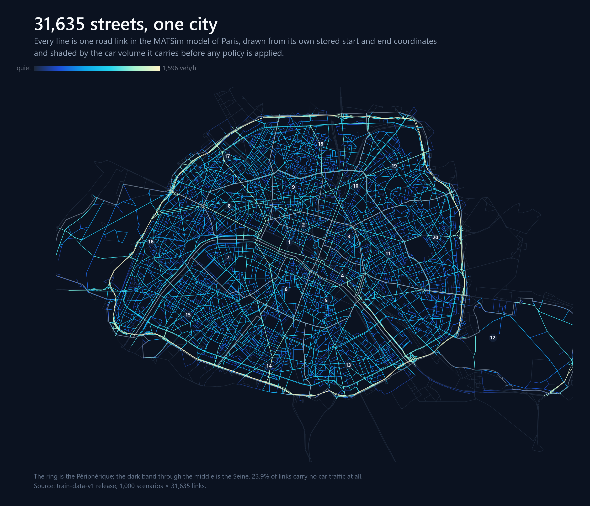
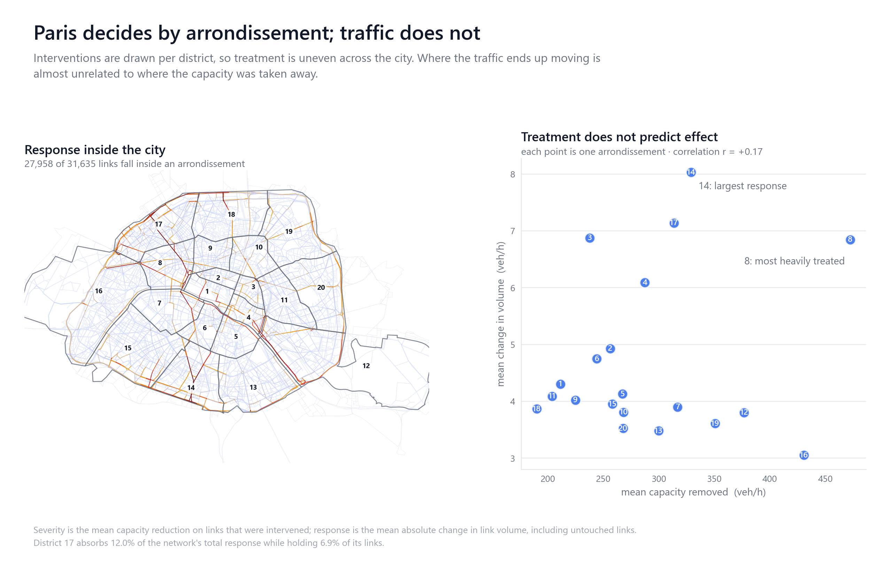
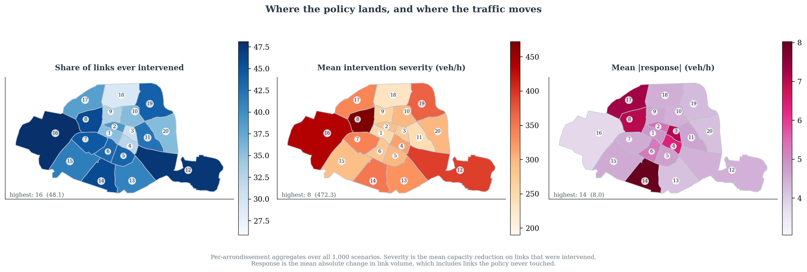
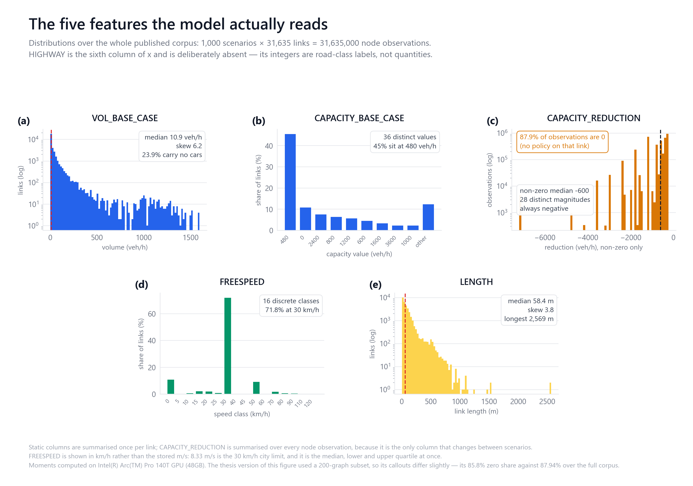
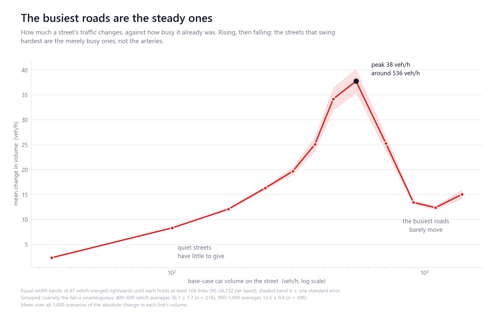
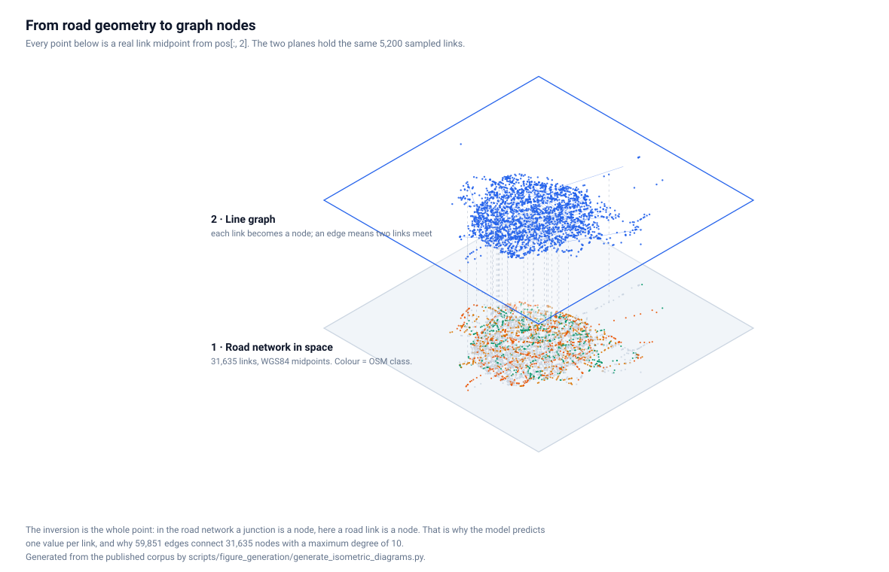
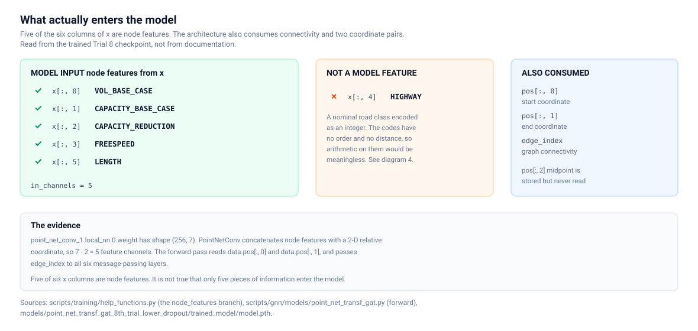
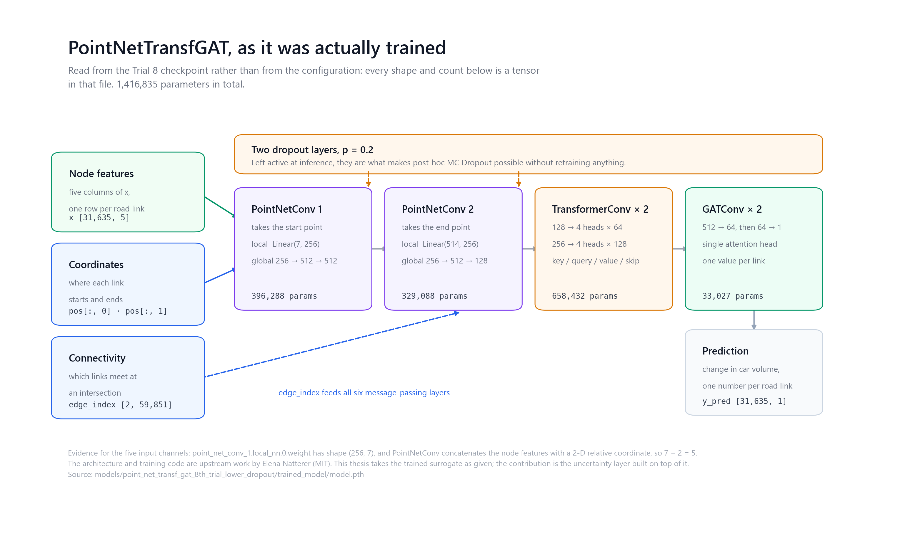
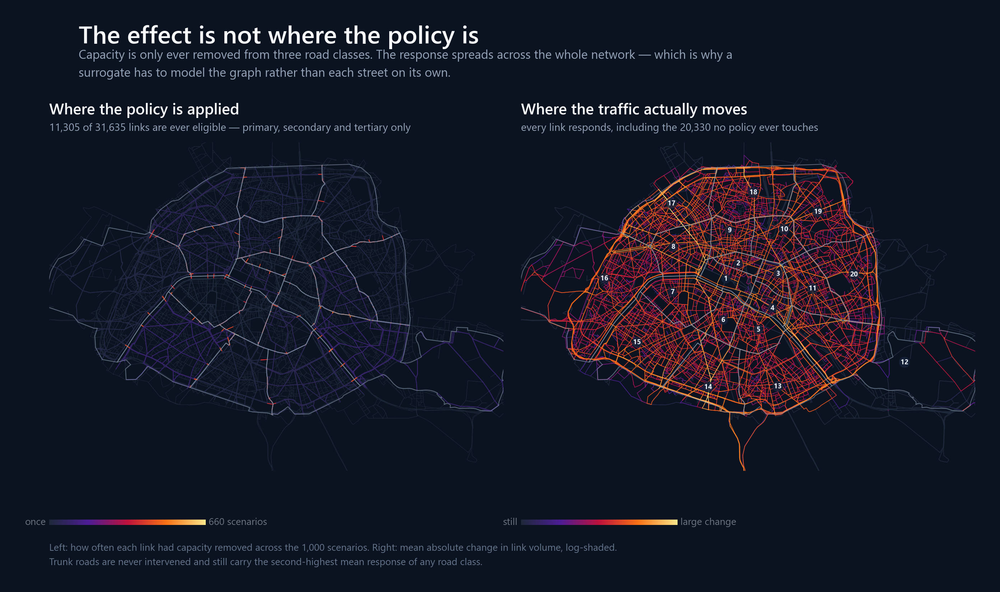

# Uncertainty Quantification for GNN Surrogates of Agent-Based Transport Models

**M.Sc. thesis** · Technical University of Munich · School of Computation, Information and Technology

|               |                                                   |
| ------------- | ------------------------------------------------- |
| **Author**    | Mohd Zamin Quadri                                  |
| **Programme** | M.Sc. Mathematics in Science and Engineering       |
| **Supervisor**| Prof. Dr. Stephan Günnemann                        |
| **Advisors**  | Dominik Fuchsgruber, M.Sc. · Elena Natterer, M.Sc. |
| **Submitted** | 15 May 2026                                        |

**[Read the thesis (PDF)](thesis/submission_2026-05-15/)** · **[Verified results](#results)** · **[Reproduce them](#reproducing-the-results)** · **[Data story](docs/portfolio_data_story/)** · **[Corrigendum](docs/CORRIGENDUM.md)**



---

## The problem

Agent-based transport simulators such as MATSim answer policy questions well but slowly —
hours per scenario. A graph neural network trained on their output answers the same
question in seconds, which is what makes large policy sweeps feasible at all.

The catch is that the surrogate returns a bare number. Nothing in it says which of the
31,635 road links it is confident about and which it is guessing at. For a model whose
output is meant to inform a decision about closing a road, that gap matters more than
another point of R².

**This thesis asks: can a useful, calibrated uncertainty estimate be attached to an
already-trained GNN surrogate, without retraining it?**

Short answer: yes, for ranking. MC Dropout σ tracks the error well enough to cut MAE by
**41%** when the least reliable half of the links are handed off, and to flag the
worst-predicted links at **0.7585 AUROC**. But raw σ is not a usable scale — it covers only
49% of errors at the nominal 90% level — so it has to be calibrated first.


---

## What is mine and what is inherited

| Origin | What it covers |
| --- | --- |
| **Inherited** (upstream) | The GNN architectures (`scripts/gnn/`), the MATSim-to-graph preprocessing (`scripts/data_preprocessing/`), the base training pipeline (`scripts/training/`), `help_functions.py` / `plot_functions.py`, and `traffic-gnn.yml`. |
| **Mine** (this thesis) | The entire uncertainty layer — MC Dropout evaluation, temperature scaling, split and adaptive conformal prediction, CQR, deep ensembles, heteroscedastic regression, selective prediction, error detection, the calibration audits, every result artifact under `results/`, the thesis document, and the verification tooling. |

Upstream is **[`enatterer/ml_surrogates_for_agent_based_transport_models`](https://github.com/enatterer/ml_surrogates_for_agent_based_transport_models)**
by **Elena Natterer**, with contributions from **Saini Rohan Rao** and **Thua Duc Nguyen**.
Their full commit history is preserved unmodified on the [`zamin_uq`](../../tree/zamin_uq)
branch — 266 commits, none of them mine. The `main` branch carries this thesis's work.

The trained surrogate itself is taken as given from that work. This thesis does not claim
the architecture, the preprocessing, or the base training procedure.

> Natterer et al. (2025). *Machine Learning Surrogates for Agent-Based Models in
> Transportation Policy Analysis.* Transportation Research Part C, 180, 105360.

---

## The experiment: Paris, by arrondissement

1,000 MATSim scenarios of the Paris Île-de-France network at 1% population sampling. Each
scenario is the **same** road network under a different capacity-reduction policy, and the
preprocessing names each one after the districts its policy touches —
`create_policy_key()` returns *"Policy introduced in Arrondissement(s) 5, 12"*. **The
arrondissement is the unit the experiment was designed around.**



88.4% of links fall inside the twenty arrondissements; the rest extend into the wider
Île-de-France. The policy only ever touches three OSM road classes — primary, secondary and
tertiary. Motorways are **never** intervened in any of the 1,000 scenarios.



Intervention rates span 25.9% (18th) to 48.1% (16th) and severity 190 to 472 veh/h (8th) —
but **local severity does not determine local response**. The 16th is intervened most and
responds least; the 17th absorbs **12.0% of the network's total response across 6.9% of its
links**, the 14th 10.3% across 5.3%.

---

## The dataset: 11 stored fields

Each scenario is one PyTorch Geometric `Data` object holding **six feature columns in `x`
plus five further tensors — eleven stored fields in total**.


| Field | Shape | Dynamic? | Model input |
| --- | --- | :-: | :-: |
| `x[:, 0]` `VOL_BASE_CASE` | `[31635, 6]` | no | ✅ |
| `x[:, 1]` `CAPACITY_BASE_CASE` | ″ | no | ✅ |
| `x[:, 2]` **`CAPACITY_REDUCTION`** | ″ | **yes** | ✅ |
| `x[:, 3]` `FREESPEED` | ″ | no | ✅ |
| `x[:, 4]` `HIGHWAY` | ″ | no | ❌ nominal codes |
| `x[:, 5]` `LENGTH` | ″ | no | ✅ |
| `pos` — start / end / midpoint, WGS84 | `[31635, 3, 2]` | no | ✅ |
| `y` — change in link volume | `[31635, 1]` | **yes** | target |
| `edge_index` | `[2, 59851]` | no | ✅ |
| `mode_stats_diff` | `[6, 3]` | yes | ❌ unused |
| `mode_stats_diff_perc` | `[6, 3]` | yes | ❌ unused |

**One column carries the whole experiment.** Five of six features, the positions and the
topology are byte-identical in every scenario; only `CAPACITY_REDUCTION` moves.

The `EdgeFeatures` enum also declares `ALLOWED_MODE_CAR` … `ALLOWED_MODE_SUBWAY` at indices
6–11, but `use_allowed_modes = False` in the preprocessing, so those six columns were
**designed and never materialised**. `x` has six columns, not twelve.



The same panel layout the thesis used, rebuilt over the whole corpus rather than a
200-graph subset. Every one of the eleven stored fields has its own card —
distribution, spatial map and relationship with the response — in
[`docs/figures/features/`](docs/figures/features/README.md).



A separate check on the stored schema found that `num_nodes` is recorded as 31,559 while
`x`, `pos` and `y` all carry 31,635 rows. The 76 extra rows are public-transport links with
no car access, no edges, and a target of exactly zero in every scenario — see
[CORRIGENDUM C11](docs/CORRIGENDUM.md).

Per-field detail: [`docs/DATASET.md`](docs/DATASET.md),
[`02_features.md`](docs/portfolio_data_story/02_features.md), and the full corpus
exploration in [`docs/data_exploration/`](docs/data_exploration/README.md).

---

## Graph representation

The network is inverted before the model sees it: **a road link is a node**, and an edge
means two links meet. 31,635 nodes, 59,851 directed edges, maximum degree 10.



Both planes hold the same real links, drawn from `pos`. Directedness, degree distribution
and the 121 components:
[`03_graph_topology.md`](docs/portfolio_data_story/03_graph_topology.md) and
[`graph_topology.md`](docs/data_exploration/graph_topology.md).

The model reads five of the six `x` columns as node features, and also consumes
`pos[:, 0]`, `pos[:, 1]` and `edge_index`. `HIGHWAY` is excluded because its integers are
nominal road-class labels, not quantities.



Traced to the code and confirmed against the trained checkpoint:
[`model_inputs.md`](docs/data_exploration/model_inputs.md).

---

## Model

`PointNetTransfGAT` — two PointNet convolutions folding in link geometry, two
graph-transformer layers, two attention layers reducing to one value per link.
**1,416,835 parameters**, read from the Trial 8 checkpoint rather than code defaults.



Every shape and count above is a tensor in the Trial 8 checkpoint. There is a card
for each of the eleven stored fields — the six columns of `x` and the five other
tensors — in [`docs/figures/features/`](docs/figures/features/README.md).

The two dropout layers are the only stochastic elements — which is exactly what makes
post-hoc MC Dropout possible without touching the weights.

---

## Experiment progression

Sixteen checkpoints across eleven trials plus a five-seed ensemble.

| Stage | Change | Outcome |
| --- | --- | --- |
| **T1–T6** | output head, weighted loss, learning rate | T1 R² 0.786 (Linear head, no dropout); weighted loss failed twice (0.225, 0.243); T5 recovered to 0.555 |
| **T7–T8** | 80/10/10 split, then dropout 0.3 → **0.2** | **T8: R² 0.5957, MAE 3.96** — the UQ baseline |
| **T9** | freeze T8, add heteroscedastic head | val NLL 3.249; no test metrics recorded |
| **T10** | full CQR retrain, 87 hours | **gate FAIL** — midpoint R² 0.406, PICP95 91.8% |
| **T11** | freeze T8, quantile head only, 40 hours | **gate PASS** — midpoint R² 0.584, PICP95 94.9% |
| **Ensemble** | 5 seeds, dropout off at inference | R² **0.684** — best accuracy — but ρ 0.400 |

> **⚠ Trials were not all scored on the same test split.** T1–T6 used **50 test graphs**
> (1,581,750 nodes); T7–T11 and the ensembles used **100** (3,163,500). R² is not comparable
> across that boundary — see [CORRIGENDUM C9](docs/CORRIGENDUM.md). All uncertainty work
> uses Trial 8 alone, so no UQ result rests on a cross-split comparison.

**Freezing beat retraining.** T10 retrained everything for 87 hours and failed its own
acceptance gates, losing most of the backbone's accuracy; T11 froze the backbone, trained
one quantile head for 40 hours, passed every gate and kept it. Same method, opposite
outcome, decided by what was allowed to move.

**The ensemble bought accuracy and lost uncertainty quality.** Most accurate model here at
R² 0.684, yet its σ ranks errors *worse* than MC Dropout — ρ 0.400 against 0.482, a 17.1%
drop recorded in its own comparison block. Better predictions did not mean better
uncertainty.

Full inventory: [`08_models_and_experiments.md`](docs/portfolio_data_story/08_models_and_experiments.md).

---

## Uncertainty quantification

Everything here is **post-hoc**: the checkpoint is loaded, frozen, never updated.


Two questions with different answers. **Does σ rank errors?** Yes — ρ = 0.482, and error
rises monotonically across σ deciles. **Is σ a calibrated scale?** No — raw σ covers only
48.6% of errors at nominal 90%.


So σ is corrected two independent ways: **temperature scaling** (one scalar, keeps an
interpretable per-link σ) and **split conformal prediction** (exact marginal coverage by
construction, at the cost of one shared width).


Four questions, four evaluations — conflating them is the usual way to overstate an
uncertainty result:


---

## Results

Every number is recomputed from its source artifact by
[`scripts/verify_headline_results.py`](scripts/verify_headline_results.py), which exits
non-zero on drift.

### Trial 8 — 100 held-out scenarios, 3,163,500 links

| Metric | Value |
| --- | --- |
| R² | **0.5957** |
| MAE / RMSE | **3.96 / 7.12** veh/h |

### Uncertainty quality

| Analysis | Trial 8 | Trial 7 |
| --- | --- | --- |
| MC Dropout Spearman ρ (σ vs abs. error) | **0.482** | 0.4437 [^t7] |
| ECE, before → after temperature scaling | 0.269 → 0.048 (T = 2.702) | — |
| Selective prediction, MAE reduction at 50% retained | **−41.2%** | −38.3% |
| Error detection AUROC, top-10% / top-20% | **0.7585 / 0.7401** [^auroc] | 0.7416 / — |
| Split conformal coverage, 90% / 95% | 90.17% / 95.09% [^prot] | 90.18% / 95.11% |


### Where the traffic actually goes

**About 65% of the response lands on links the policy never touched.** Mean |response| is
13.06 veh/h on intervened links against 2.91 elsewhere, but the untouched links are so
numerous they carry two-thirds of the total effect. The graph-distance profile drops 4.4×
at the first hop and is then **flat out to eight hops** — an observed network-wide
redistribution rather than a gradient that fades with distance.

It survives its reachability control (one hop reaches only 32% of the network, three reach
70%) and holds under both directed and undirected traversal. It is an association, not
evidence of a mechanism. See [`05_spillover.md`](docs/portfolio_data_story/05_spillover.md).



[^t7]: The thesis reports 0.446 for Trial 7. That value is not reproducible from the
    retained archive, which yields 0.4437 under the definition that reproduces Trial 8
    exactly. See [CORRIGENDUM C7b](docs/CORRIGENDUM.md).

[^auroc]: **Corrected after submission.** The submitted thesis reports 0.7548 and 0.7324,
    citing a file absent from this repository. Recomputation from the cited artifact gives
    0.7585 and 0.7401. The figure above reports 0.7561 / 0.7378 for the same metric because
    it reads the tracked NPZ archive — a different stochastic MC Dropout replay of the same
    model. Both are correct for the artifact they name; see
    [CORRIGENDUM C4 and C7a](docs/CORRIGENDUM.md).

[^prot]: Protocol `graph20_80_v1` — calibrate on the first 20 test graphs, evaluate on the
    remaining 80. The thesis reports 90.02% / 95.01% under a 50/50 scenario split whose
    indices were not retained. The two must not be pooled; see
    [CORRIGENDUM C3](docs/CORRIGENDUM.md).

### What this does not establish

One Paris network, one capacity-reduction intervention family, a 1,000-scenario subset, one
model family. Conformal coverage is marginal over the evaluated split — not a guarantee for
any individual scenario, link, city, or policy.

---

## Reproducing the results

```bash
git clone https://github.com/mzquadri/ml_surrogates_for_agent_based_transport_models.git
cd ml_surrogates_for_agent_based_transport_models

conda env create -f environment-minimal.yml
conda activate traffic-gnn

python scripts/verify_headline_results.py        # recompute every headline number
```

That runs against tracked artifacts and needs no downloads. Two of the thirteen checks —
the AUROC pair — report `SKIP` until the 209 MB ablation CSV is fetched:

```bash
gh release download thesis-data-v1 \
  --repo mzquadri/ml_surrogates_for_agent_based_transport_models \
  --pattern '*trial8_uq_ablation_results.csv' --dir /tmp/large
python scripts/restore_large_files.py /tmp/large
```

Analyses, figures and data exploration:

```bash
python scripts/evaluation/run_part4_t7_crosscheck.py          # no downloads needed
python scripts/figure_generation/generate_results_figures.py  # no downloads needed
python scripts/data_exploration/explore_checkpoints.py        # all 16 checkpoints
python scripts/data_exploration/explore_arrondissements.py --corpus <dir> --cache <dir>
```

These replay the analyses from cached prediction arrays. They do not retrain the models and
do not rerun MATSim — the raw simulation outputs were not retained.
[`docs/CORRIGENDUM.md`](docs/CORRIGENDUM.md) C5 states the replay boundaries;
[`DATA.md`](DATA.md) covers artifact availability.

---

## The figures

Every figure is generated from the published corpus by a tracked script and rebuilds
byte-identically. Nothing is drawn by hand.

| | What it shows | Where |
|---|---|---|
| **The network** | 31,635 real street segments, shaded by traffic | [gallery](docs/figures/portfolio/README.md) |
| **Five model features** | the (a)–(e) panel figure, full corpus | [gallery](docs/figures/portfolio/README.md) |
| **Eleven field cards** | one card per stored field | [features](docs/figures/features/README.md) |
| **Policy vs response** | where the policy lands against where traffic moves | [gallery](docs/figures/portfolio/README.md) |
| **Model architecture** | read from the Trial 8 checkpoint | [gallery](docs/figures/portfolio/README.md) |
| **Arrondissements** | districts from the GeoJSON, overlaid on the network | [gallery](docs/figures/portfolio/README.md) |
| **Structural diagrams** | problem, features, model, uncertainty, evaluation | [`docs/diagrams/`](docs/diagrams/) |
| **Data anatomy** | `.pt` schema, the eleven fields, why HIGHWAY is excluded | [`docs/diagrams_data/`](docs/diagrams_data/) |

```bash
CORPUS=/path/to/corpus       # gh release download train-data-v1
CACHE=/path/to/scratch
python scripts/data_exploration/explore_tensors.py          --corpus $CORPUS --cache $CACHE
python scripts/figure_generation/generate_portfolio_figures.py  --corpus $CORPUS --cache $CACHE
python scripts/figure_generation/generate_feature_cards.py      --corpus $CORPUS --cache $CACHE
python scripts/figure_generation/generate_five_features_figure.py --corpus $CORPUS --cache $CACHE
python scripts/figure_generation/generate_model_diagram.py
```

Maps draw the real street geometry from `pos[:, 0]` to `pos[:, 1]`, and district
boundaries come from the arrondissement GeoJSON — the same CRS84 longitude and latitude,
so the two overlay without reprojection. Heavy reductions use the Intel Arc GPU through
`torch.xpu` where it helps, which is about fifteen times faster than numpy for this shape.

---

## Repository layout

```
scripts/
  verify_headline_results.py   Recomputes every published number; non-zero exit on drift
  check_docs.py                Link and SVG gate
  restore_large_files.py       Rebuilds the data tree from the releases
  data_exploration/            Dataset, arrondissement and checkpoint analysis
  evaluation/  figure_generation/
  gnn/  training/  data_preprocessing/     Upstream model, training and preprocessing
  archive/                     Historical one-offs — provenance only, not runnable
docs/
  DATASET.md  CORRIGENDUM.md  ARTIFACT_PROVENANCE.md
  portfolio_data_story/        Deep corpus analysis + derived web assets
  data_exploration/            Stored fields, model inputs, topology, auxiliary tensors
  diagrams/  diagrams_isometric/  diagrams_data/  figures/
  migration/                   Repository-consolidation record
models/     16 trial checkpoints
results/    Result JSONs, prediction archives, per-trial metrics
thesis/     submission_2026-05-15/ (examined) and latex_tum_official/ (working)
tests/
```

All large artifacts are published as **[Releases on this repository](../../releases)** —
the training corpus, per-trial evaluation outputs, oversized prediction archives, and the
migrated per-trial data. Everything the thesis needs is here or on those releases; there is
no companion repository. See [`DATA.md`](DATA.md).

---

## Licence and attribution

Upstream code is under the **MIT Licence, © 2024 Elena Natterer**, reproduced in
[`LICENSE`](LICENSE). Those terms govern `scripts/gnn/`, `scripts/data_preprocessing/`,
`scripts/training/`, `scripts/evaluation/help_functions.py`,
`scripts/evaluation/plot_functions.py`, the upstream notebooks, and `traffic-gnn.yml`, and
anything derived from them.

Material added by this fork — the thesis text and figures, the trained checkpoints, and the
result artifacts — is **not** covered by that grant. Reuse requires prior permission from
the author and, where applicable, the original data and model owners.

Citation metadata: [`CITATION.cff`](CITATION.cff).

## Tooling

AI coding assistants were used for code review, refactoring, and repository maintenance.
All research design, modelling decisions, analysis, and written content are the author's
own, and every reported number is verified against the artifacts in this repository by a
script anyone can run.
