# Uncertainty Quantification for GNN Surrogates of Agent-Based Transport Models

**M.Sc. thesis** · Technical University of Munich · School of Computation, Information and Technology

|               |                                                   |
| ------------- | ------------------------------------------------- |
| **Author**    | Mohd Zamin Quadri                                  |
| **Programme** | M.Sc. Mathematics in Science and Engineering       |
| **Supervisor**| Prof. Dr. Stephan Günnemann                        |
| **Advisors**  | Dominik Fuchsgruber, M.Sc. · Elena Natterer, M.Sc. |
| **Submitted** | 15 May 2026                                        |

**[Read the thesis (PDF)](thesis/submission_2026-05-15/)** · **[Verified results](#results)** · **[Reproduce them](#reproducing-the-results)** · **[Corrigendum](docs/CORRIGENDUM.md)**

---

## The problem

Agent-based transport simulators such as MATSim answer policy questions well but slowly — hours per
scenario. A graph neural network trained on their output answers the same question in seconds, which
is what makes large policy sweeps feasible at all.

The catch is that the surrogate returns a bare number. Nothing in it says which of the 31,635 road
links it is confident about and which it is guessing at. For a model whose output is meant to inform
a decision about closing a road, that gap matters more than another point of R².

**This thesis asks: can a useful, calibrated uncertainty estimate be attached to an already-trained
GNN surrogate, without retraining it?**

Short answer: yes, for ranking. MC Dropout σ tracks the error well enough to cut MAE by **41%** when
the least reliable half of the links are handed off, and to flag the worst-predicted links at
**0.7585 AUROC**. But raw σ is not a usable scale — it covers only 49% of errors at the nominal 90%
level — so it has to be calibrated first. [Full results below.](#results)

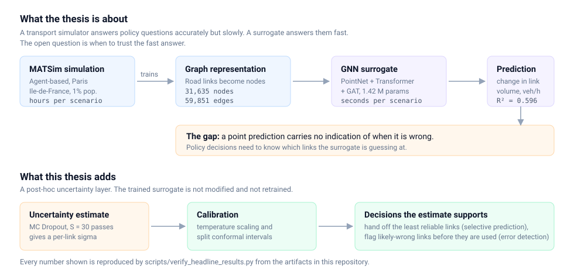

---

## What is mine and what is inherited

This repository is a fork, and the distinction matters.

| Origin | What it covers |
| --- | --- |
| **Inherited** (upstream) | The GNN architectures (`scripts/gnn/`), the MATSim-to-graph preprocessing (`scripts/data_preprocessing/`), the base training pipeline (`scripts/training/`), `help_functions.py` / `plot_functions.py`, and `traffic-gnn.yml`. |
| **Mine** (this thesis) | The entire uncertainty layer — MC Dropout evaluation, temperature scaling, split and adaptive conformal prediction, selective prediction, error detection, the calibration audits, the deep-ensemble and CQR trials, every result artifact under `results/`, the thesis document, and the verification tooling. |

Upstream is **[`enatterer/ml_surrogates_for_agent_based_transport_models`](https://github.com/enatterer/ml_surrogates_for_agent_based_transport_models)**
by **Elena Natterer**, with contributions from **Saini Rohan Rao** and **Thua Duc Nguyen**. Their full
commit history is preserved unmodified on the [`zamin_uq`](../../tree/zamin_uq) branch of this
repository — 266 commits, none of them mine. The `main` branch carries this thesis's work.

The trained surrogate itself is taken as given from that work. This thesis does not claim the
architecture, the preprocessing, or the base training procedure.

> Natterer et al. (2025). *Machine Learning Surrogates for Agent-Based Models in Transportation
> Policy Analysis.* Transportation Research Part C, 180, 105360.

---

## Data

1,000 MATSim scenarios of the Paris Île-de-France network at 1% population sampling. Each scenario is
the **same** road network under a different capacity-reduction policy.

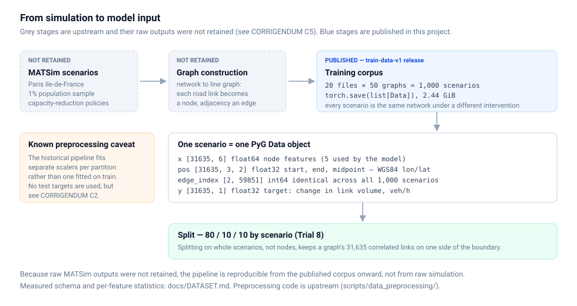

The network is expressed as a **line graph**: each road link is a node, and an edge means two links
meet. Every scenario has 31,635 nodes and 59,851 edges, and the topology is byte-identical across all
1,000 of them.

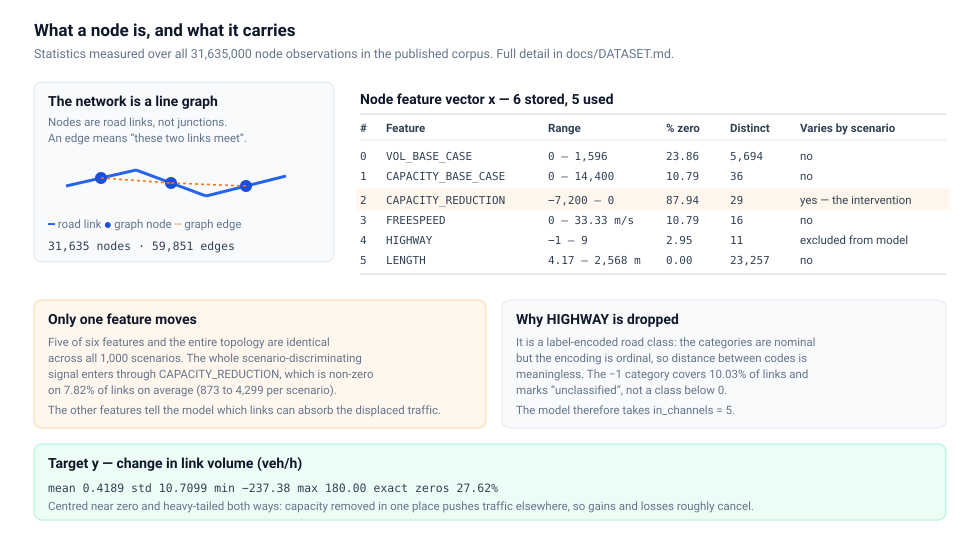

Six features are stored and five are used — `HIGHWAY` is dropped because it is an ordinally-encoded
nominal category. The single most important property of this dataset is that **only
`CAPACITY_REDUCTION` varies between scenarios**; everything else is constant context.

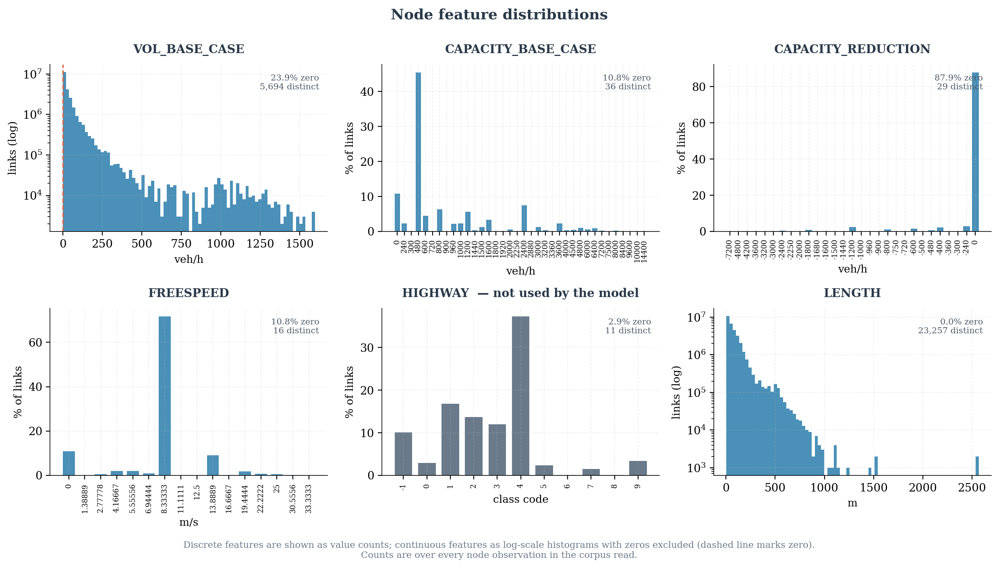

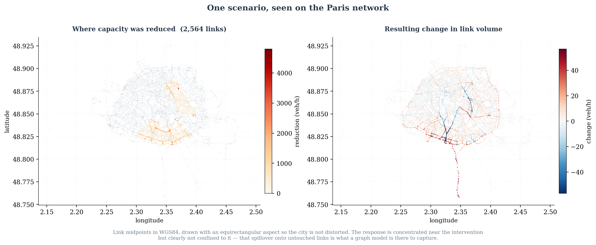

Measured schema, per-feature statistics and the scenario-invariance analysis:
**[`docs/DATASET.md`](docs/DATASET.md)**. Further figures in [`docs/figures/dataset/`](docs/figures/dataset/).

A deeper read of the corpus — every attribute traced to the preprocessing code, the
intervention design, the graph topology, and eight data-quality observations — is in
**[`docs/portfolio_data_story/`](docs/portfolio_data_story/)**, with reproducible scripts under
`scripts/data_exploration/`. Two findings from it are worth knowing here: about **65% of the
traffic response lands on links that were never intervened**, and the policy only ever touches
three road classes (primary, secondary, tertiary) — motorways are never intervened yet carry the
second-highest mean response.

---

## Model

`PointNetTransfGAT` — two PointNet convolutions that fold in link geometry, two graph-transformer
layers, and two attention layers that reduce to one value per link. **1,416,835 parameters**, read
from the Trial 8 checkpoint rather than from code defaults.

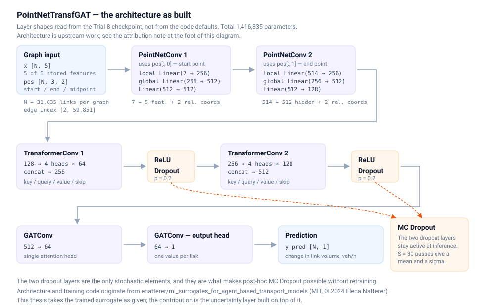

The two dropout layers are the only stochastic elements, and they are what makes post-hoc MC Dropout
possible without touching the weights.

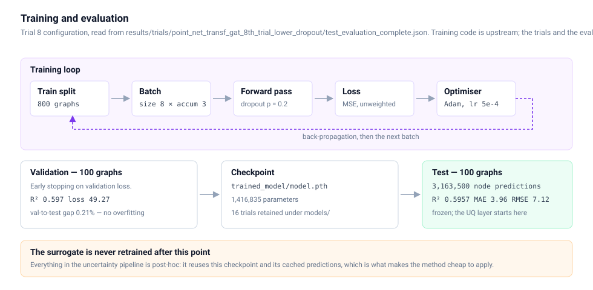

Sixteen trials are retained under `models/`. Trial 8 (dropout 0.2, 80/10/10 scenario split) is the
best of the directly comparable ones and is the baseline for all uncertainty work.

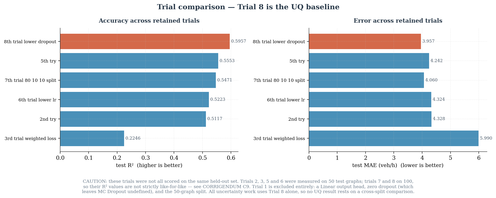

---

## Uncertainty quantification

Everything below is **post-hoc**: the checkpoint is loaded, frozen, and never updated.

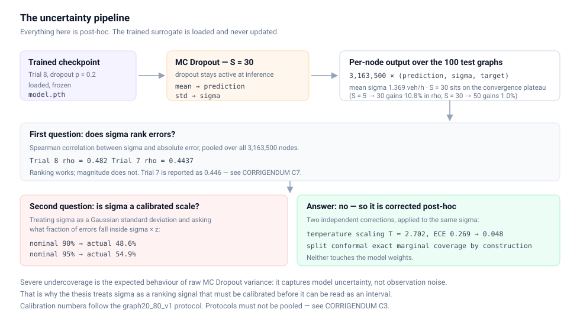

MC Dropout keeps dropout active at inference and runs S = 30 forward passes; the mean is the
prediction and the standard deviation is σ. Two questions follow, and they have different answers:

- **Does σ rank errors?** Yes — Spearman ρ = 0.482, and error rises monotonically across σ deciles.
- **Is σ a calibrated scale?** No — raw σ covers only 48.6% of errors at the nominal 90% level.

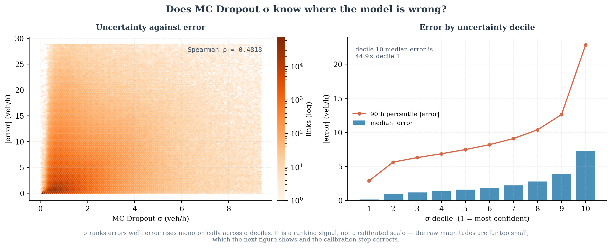

So σ is corrected post-hoc, two independent ways: **temperature scaling** (one scalar, keeps a single
interpretable σ per link) and **split conformal prediction** (exact marginal coverage by
construction, at the cost of one shared interval width).

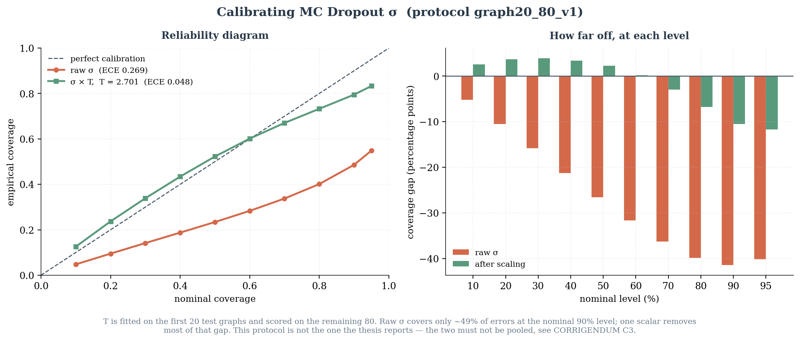

---

## Evaluation

Four questions, four evaluations. Conflating them is the usual way to overstate an uncertainty result.

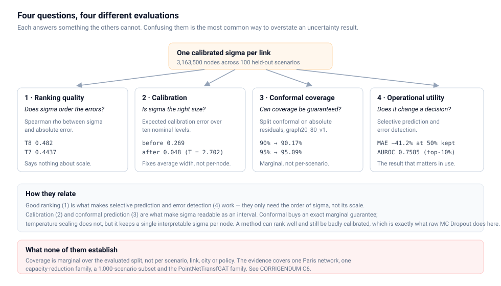

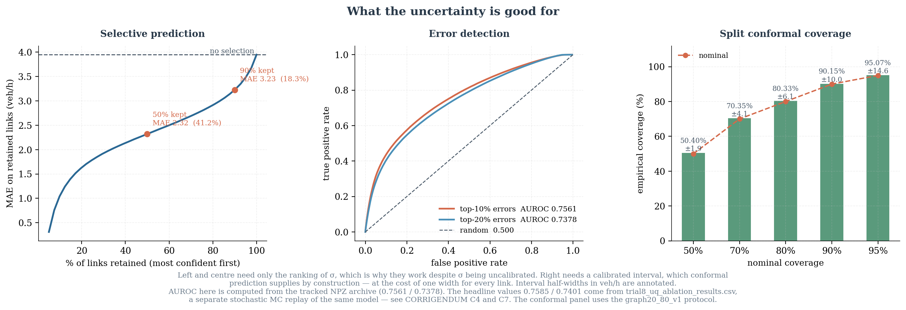

---

## Results

Every number here is recomputed from its source artifact by
[`scripts/verify_headline_results.py`](scripts/verify_headline_results.py), which exits non-zero if
any of them drifts.

### Surrogate accuracy — Trial 8, 100 held-out scenarios, 3,163,500 links

| Metric | Value | Source |
| --- | --- | --- |
| R² | 0.5957 | `deterministic_full_100graphs.npz` |
| MAE | 3.96 veh/h | `deterministic_full_100graphs.npz` |
| RMSE | 7.12 veh/h | `deterministic_full_100graphs.npz` |

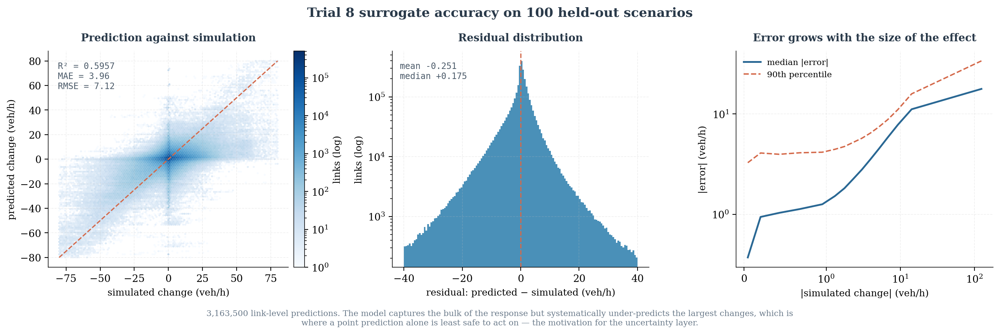

### Uncertainty quality

| Analysis | Trial 8 | Trial 7 |
| --- | --- | --- |
| MC Dropout Spearman ρ (σ vs abs. error) | **0.482** | **0.4437** [^t7] |
| ECE, before → after temperature scaling | 0.269 → 0.048 (T = 2.702) | — |
| Selective prediction, MAE reduction at 50% retained | **−41.2%** | −38.3% |
| Error detection AUROC, top-10% errors | **0.7585** [^auroc] | 0.7416 |
| Error detection AUROC, top-20% errors | **0.7401** [^auroc] | — |
| Split conformal coverage, 90% / 95% nominal | 90.17% / 95.09% [^prot] | 90.18% / 95.11% |

[^t7]: The thesis reports 0.446 for Trial 7. That value is not reproducible from the retained
    archive, which yields 0.4437 under the definition that reproduces Trial 8 exactly. Recorded as
    [CORRIGENDUM C7b](docs/CORRIGENDUM.md).

[^auroc]: **Corrected after submission.** The submitted thesis reports 0.7548 and 0.7324, citing a
    file that is not present in this repository. Recomputation from the cited source artifact —
    `trial8_uq_ablation_results.csv` — gives 0.7585 and 0.7401, matching
    `docs/verified/UQ_ERROR_DETECTION_T8.md` exactly. See [CORRIGENDUM C7a](docs/CORRIGENDUM.md).
    The figure above reports 0.7561 / 0.7378 for the same metric because it is computed from the
    tracked NPZ archive, which is a **different stochastic MC Dropout replay** of the same model.
    Both are correct for the artifact they name; MC Dropout is not bit-reproducible across replays,
    which is why every number in this repository states its archive. See
    [CORRIGENDUM C4](docs/CORRIGENDUM.md).

[^prot]: Protocol `graph20_80_v1` — calibrate on the first 20 test graphs, evaluate on the remaining
    80. This is the replayable protocol. The thesis reports 90.02% / 95.01% under a 50/50 scenario
    split whose indices were not retained. The two must not be pooled; see
    [CORRIGENDUM C3](docs/CORRIGENDUM.md).

### What this does not establish

One Paris network, one capacity-reduction intervention family, a fixed 1,000-scenario subset, and one
model family. Conformal coverage is marginal over the evaluated split — it is not a guarantee for any
individual scenario, link, city, or policy. The submitted thesis also overstated the target's zero
mass; that is corrected in [CORRIGENDUM C1](docs/CORRIGENDUM.md).

---

## Reproducing the results

```bash
git clone https://github.com/mzquadri/ml_surrogates_for_agent_based_transport_models.git
cd ml_surrogates_for_agent_based_transport_models

conda env create -f environment-minimal.yml
conda activate traffic-gnn

python scripts/verify_headline_results.py        # recompute every headline number
```

That runs against artifacts tracked in this repository and needs no downloads. Two of the thirteen
checks — the AUROC pair — report `SKIP` until the 209 MB ablation CSV is fetched:

```bash
gh release download thesis-data-v1 --repo mzquadri/ml_surrogates_for_agent_based_transport_models \
  --pattern '*trial8_uq_ablation_results.csv' \
  --dir data/TR-C_Benchmarks/point_net_transf_gat_8th_trial_lower_dropout/
```

The full analyses and the figures:

```bash
python scripts/evaluation/run_part4_t7_crosscheck.py      # Trial 7 cross-check (no downloads)
python scripts/evaluation/run_part2_uq_analyses.py        # selective prediction + error detection
python scripts/evaluation/run_part3_calibration_audit.py  # calibration and conformal coverage
python scripts/figure_generation/generate_results_figures.py
python scripts/figure_generation/generate_dataset_figures.py --corpus <corpus dir>
```

Parts 2 and 3 need the ablation CSV above. The dataset figures need the training corpus, published on
the [`train-data-v1`](../../releases/tag/train-data-v1) release (20 files, 2.44 GiB). Set
`THESIS_DATA_ROOT` to point at a data tree you already have, and the scripts will find it.

**What is reproducible and what is not.** These commands replay the analyses from cached prediction
arrays. They do not retrain the models and do not rerun MATSim — the raw simulation outputs were not
retained. [`docs/CORRIGENDUM.md`](docs/CORRIGENDUM.md) C5 states the replay boundaries precisely, and
[`DATA.md`](DATA.md) covers artifact availability.

---

## Repository layout

```
scripts/
  verify_headline_results.py    Recomputes every published number; non-zero exit on drift
  evaluation/                   UQ analyses, calibration audit, cross-checks
  figure_generation/            Dataset and results figures
  data_exploration/             Reproducible dataset analysis and asset builder
  gnn/  training/  data_preprocessing/    Upstream model, training and preprocessing code
  archive/                      Historical one-offs — provenance only, not runnable
docs/
  DATASET.md                    Measured schema and per-feature statistics
  portfolio_data_story/         Deep read of the corpus + derived web assets
  CORRIGENDUM.md                Post-submission corrections, including C7
  UQ_SUMMARY.md                 April 2026 summary, partly superseded
  verified/                     Audit reports and the figures behind them
  diagrams/  figures/           Explanatory diagrams and generated figures
models/                         16 trial checkpoints
results/                        Result JSONs, prediction archives, per-trial metrics
thesis/
  submission_2026-05-15/        The examined document — frozen, do not edit
  latex_tum_official/           Working LaTeX, edited since submission
tests/                          Test suite (pytest)
```

> The examined thesis is `thesis/submission_2026-05-15/`. The working LaTeX in
> `thesis/latex_tum_official/` has been edited since and compiles to a different PDF.

Large artifacts live on this repository's releases rather than in the tree: the training
corpus ([`train-data-v1`](../../releases/tag/train-data-v1)), per-trial evaluation outputs
([`benchmarks-v1`](../../releases/tag/benchmarks-v1)), oversized prediction archives
([`results-large-v1`](../../releases/tag/results-large-v1)), and the per-trial artifacts
that exceed GitHub's file limit ([`thesis-data-v1`](../../releases/tag/thesis-data-v1)).
Everything the thesis needs is in this repository or its releases — there is no companion
data repository. See [`DATA.md`](DATA.md).

---

## Licence and attribution

Upstream code is under the **MIT Licence, © 2024 Elena Natterer**, reproduced in
[`LICENSE`](LICENSE). Those terms govern `scripts/gnn/`, `scripts/data_preprocessing/`,
`scripts/training/`, `scripts/evaluation/help_functions.py`, `scripts/evaluation/plot_functions.py`,
the upstream notebooks, and `traffic-gnn.yml`, and anything derived from them.

Material added by this fork — the thesis text and figures, the trained checkpoints, and the result
artifacts — is **not** covered by that grant. Reuse requires prior permission from the author and,
where applicable, the original data and model owners.

Citation metadata: [`CITATION.cff`](CITATION.cff).

## Tooling

AI coding assistants were used for code review, refactoring, and repository maintenance. All research
design, modelling decisions, analysis, and written content are the author's own, and every reported
number is verified against the artifacts in this repository by a script that anyone can run.
