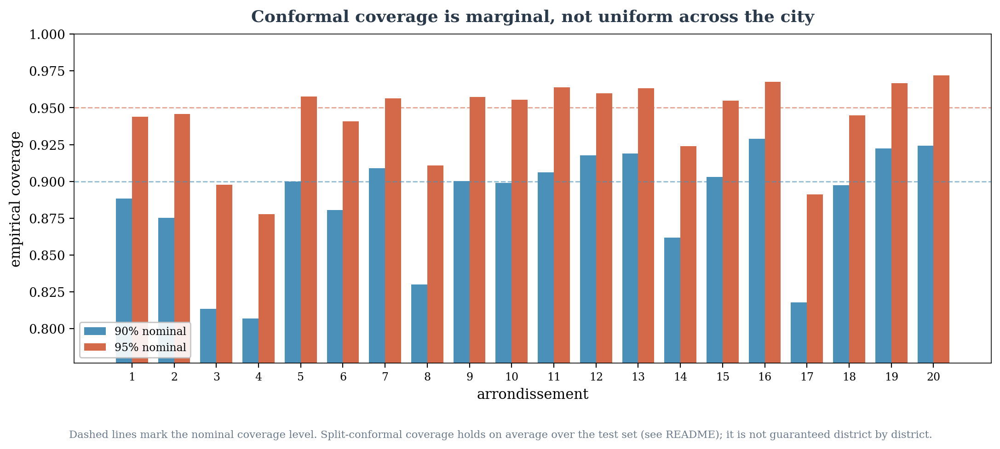

# Does Conformal Coverage Hold by Arrondissement?

**Status:** new analysis, not part of the examined thesis. Uses only artifacts already
tracked or resolvable in this repository — no retraining, no new inference.

`docs/CORRIGENDUM.md` C3 already states the standard conformal-prediction caveat: the
reported 90%/95% coverage is *marginal* — averaged over the whole test set — not a
per-scenario, per-link, or per-district guarantee. `results/conformal_conditional_coverage_t8.json`
already checked one conditioning variable (MC Dropout sigma decile) and found coverage
degrading at high sigma. This note checks the geographic axis the experiment itself was
designed around — the 20 Paris arrondissements — since the README's own data story shows
intervention rate and severity vary sharply by district.

## Method

Same split-conformal recipe as `scripts/evaluation/run_part3_calibration_audit.py`: the
first 20% of rows (graphs 1–20, in the graph-major row order every artifact in this
repository uses) calibrate a global absolute-residual quantile at the 90%/95% nominal
level; the remaining 80% (graphs 21–100) are scored against it. Each of the 31,635 links
is assigned to an arrondissement by the same point-in-polygon join used in
`scripts/data_exploration/explore_arrondissements.py` (link midpoint against
`data/visualisation/districts_paris.geojson`).

Reproduce: `python scripts/analysis/coverage_by_arrondissement.py --corpus DIR --cache DIR`
Output: `results/conformal_coverage_by_arrondissement.json`,
`docs/figures/results/06_coverage_by_arrondissement.png`.

## Result

Global coverage on the eval split matches the headline numbers: **90.17%** at the 90%
level, **95.09%** at the 95% level. Broken out by arrondissement, it does not hold evenly:
**11 of 20** districts fall below their 90% nominal level, and **9 of 20** fall below 95%.
The worst is the 4th arrondissement at **80.68%** (90% nominal) / **87.77%** (95%
nominal) — roughly 9–10 points short. The best, the 20th, over-covers at 92.4% / 97.2%.

## What this does and does not show

A Spearman correlation between per-district coverage and the mean intervention severity
already reported in `docs/portfolio_data_story/assets/arrondissements.json` is weak and
not significant (ρ = 0.20, p = 0.39) — the districts with the worst coverage are **not**
simply the ones hit hardest by the policy interventions.

Coverage correlates instead with the number of links in the district (ρ = 0.55,
p = 0.011): the three worst-covered arrondissements (3rd, 4th, 8th) are among the
smallest by link count (381, 535, and 1,224 links), so part of the spread is plausibly
sampling variance in the per-district estimate rather than a systematic miscalibration —
a coverage estimate over a few hundred eval nodes is noisier than one over several
thousand. The 17th arrondissement is the exception that breaks this pattern: 2,179 links
(not small) but still only 81.8% / 89.1% coverage, and it is independently flagged in the
README as the single highest-response district (12.0% of the network's total mean
response across 6.9% of its links) — a case worth treating as a genuine, not merely
sample-size-driven, undercoverage finding.

**This note does not establish a causal geographic effect.** It establishes that marginal
coverage, exactly as the conformal-prediction literature predicts, does not transfer to a
per-district guarantee here, and flags the 4th and 17th arrondissements as the two
locations where a user relying on the stated confidence level would be most
misled — for different likely reasons in each case.
