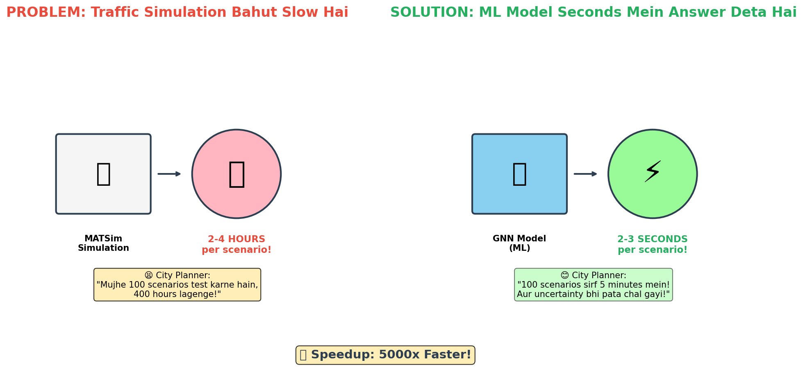
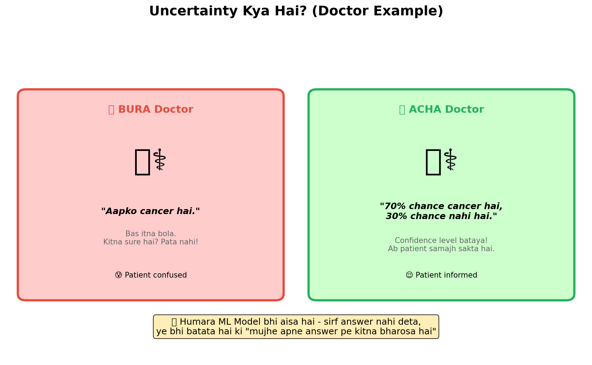
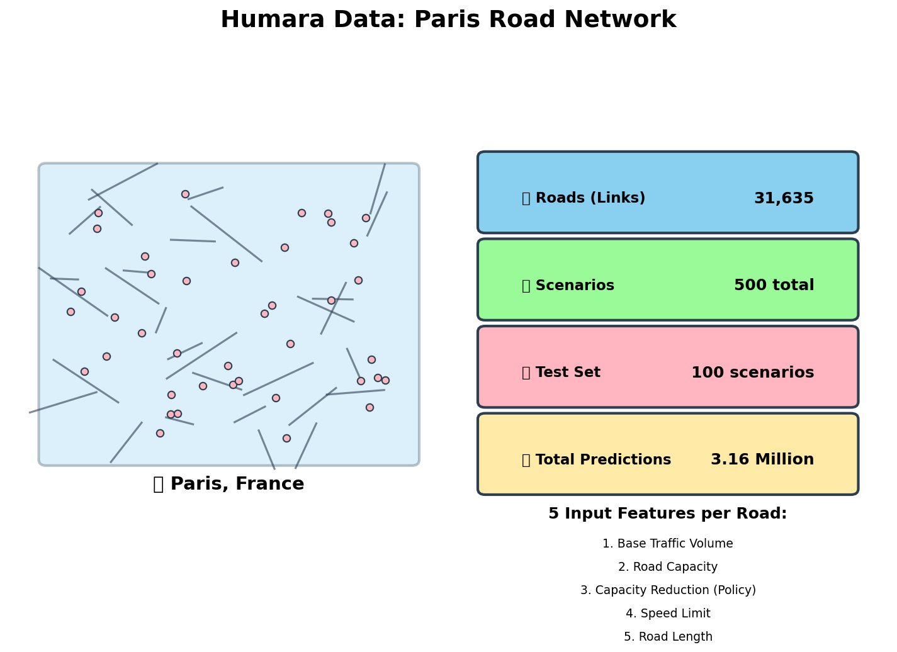
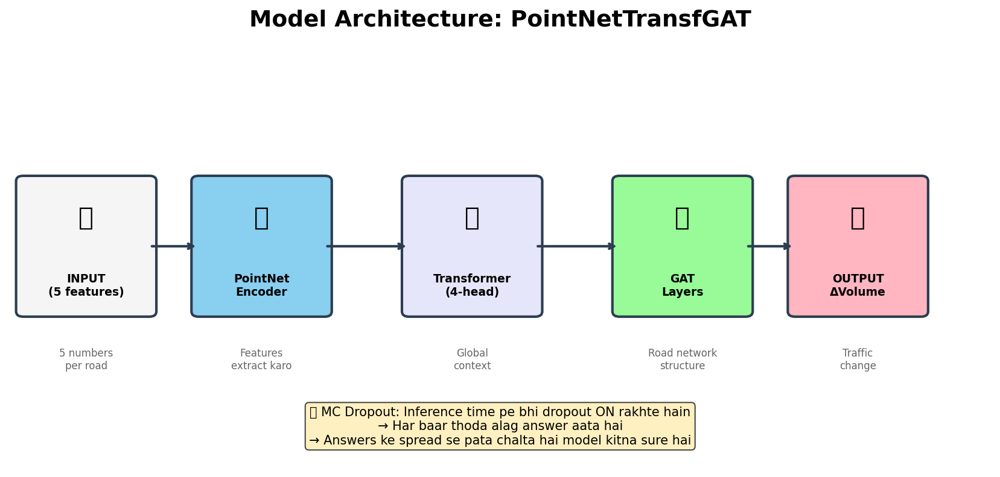
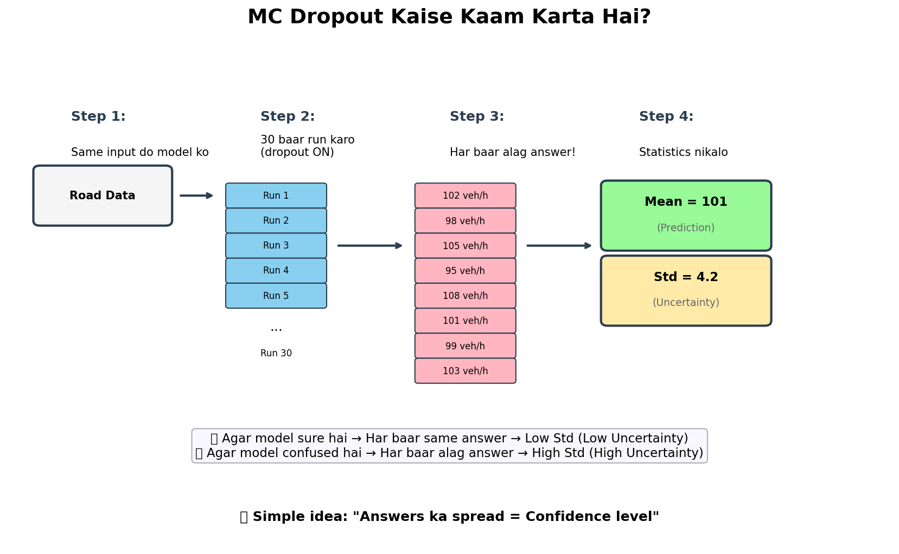
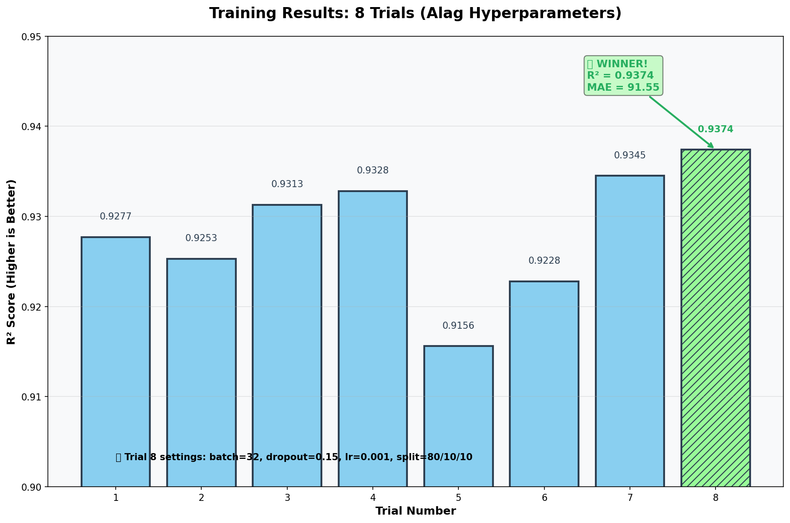
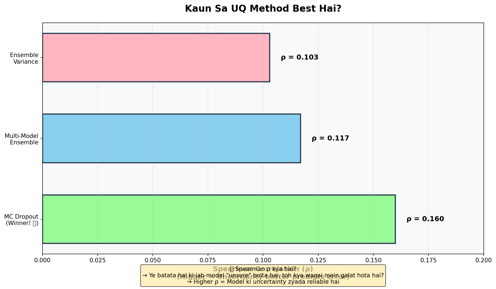
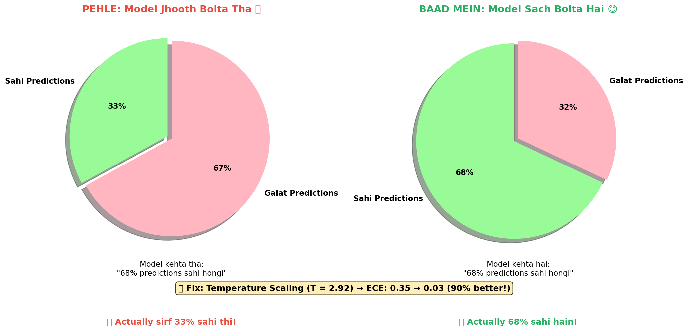
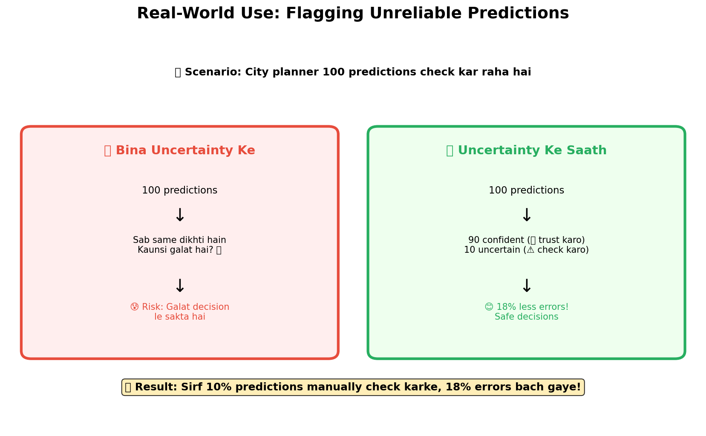
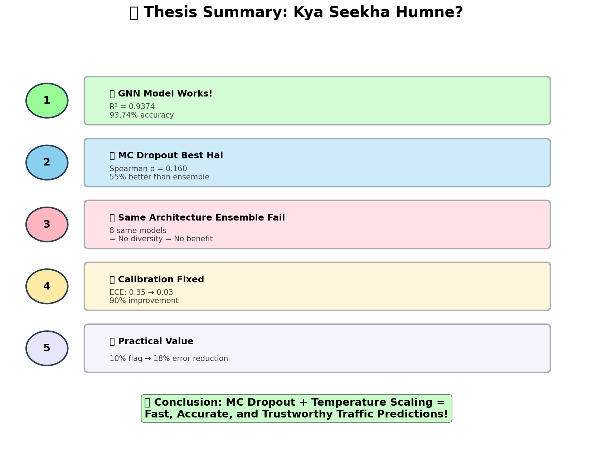

# 🎓 Meri Thesis - Poori Kahani Simple Words Mein

**Thesis Title:** Uncertainty Quantification for Graph Neural Network Surrogates of Agent-Based Transport Models

**Student:** Nazim Zaman  
**University:** Technical University of Munich (TUM)  
**Date:** February 2026

---

## Ye Document Kyun Hai?

Ye document thesis ke saare concepts ko simple Urdu/Hindi mein explain karta hai. Har section ke saath ek visual chart hai jo samajhne mein madad karega.

**Charts Location:** `docs/visuals/` folder mein dekho

---

# Part 1: Problem aur Solution

## Problem Kya Tha?

Imagine karo tum city planner ho. Tumhe ye decide karna hai:
- "Agar main ye road band kar doon, traffic kahan jayega?"
- "Agar speed limit change karoon, kya hoga?"

Is sawal ka jawab dene ke liye **traffic simulation** use hoti hai. MATSim naam ka software hai jo properly simulate karta hai:
- Har gaari ka path
- Traffic lights
- Rush hour effects
- Sab kuch!

**Lekin problem ye hai:**
- Ek scenario simulate karne mein **2-4 hours** lagte hain
- Agar tumhe 100 scenarios test karne hain = **400 hours** (16 din!)
- City planners ke paas itna time nahi hota

## Solution Kya Banaya?

**Machine Learning Model** jo MATSim ka "fast copy" hai:
- Simulation ke results seekh leta hai
- Phir **seconds mein** predict kar deta hai
- 5000x faster!

**Extra Feature (Humara Contribution):**
Sirf answer nahi deta, ye bhi batata hai:
- "Mujhe apne answer pe kitna bharosa hai?"
- "Kahan pe main galat ho sakta hoon?"

Is extra feature ko kehte hain **Uncertainty Quantification (UQ)**

---

# Part 2: Uncertainty Kya Hai?

## Doctor Example Se Samjho

**Bura Doctor:**
- "Aapko cancer hai" - bas itna bola
- Kitna sure hai? Pata nahi
- Patient confused: "Pakka hai ya doubt hai?"

**Acha Doctor:**
- "70% chance hai ki cancer hai, 30% chance nahi hai"
- Confidence level bataya
- Patient samajh sakta hai aur sahi decision le sakta hai

## Humara Model Bhi Aisa Hai

| Bina UQ | UQ Ke Saath |
|---------|-------------|
| "Traffic 500 veh/h hoga" | "Traffic 500 ± 50 veh/h hoga (90% confident)" |
| Sab predictions same dikhti hain | Pata chalta hai kaunsi reliable hai |
| Risk: Galat decision | Informed decision |

---

# Part 3: Humara Data

## Paris Ka Road Network

Humne Paris city ka real road network use kiya:

| Stat | Value |
|------|-------|
| Roads (Links) | 31,635 |
| Total Scenarios | 500 |
| Test Scenarios | 100 |
| Total Predictions | 31,63,500 (3.16 Million) |

## Har Road Ke 5 Features

| # | Feature | Matlab |
|---|---------|--------|
| 1 | VOL_BASE_CASE | Pehle kitni traffic thi |
| 2 | CAPACITY | Road ki max capacity (cars/hour) |
| 3 | CAPACITY_REDUCTION | Policy: kitni capacity kam ki (0-100%) |
| 4 | FREESPEED | Speed limit (km/h) |
| 5 | LENGTH | Road ki length (meters) |

## Output Kya Hai?

**ΔVolume (Delta Volume)** = Traffic volume change
- Positive = Traffic badh gayi
- Negative = Traffic kam ho gayi
- Zero = Koi change nahi

---

# Part 4: Model Architecture

## PointNetTransfGAT - Naam Decode

Is model mein 3 parts hain:

### 1. PointNet Encoder
- 5 input features leta hai
- Unhe 64-dimensional vector mein convert karta hai
- "Feature extraction" karta hai

### 2. Transformer (4-head attention)
- Saari roads ko ek saath dekhta hai
- "Global context" samajhta hai
- "Is road ka puri city pe kya asar hai?"

### 3. GAT (Graph Attention Network)
- Road network ka graph structure use karta hai
- Connected roads ke beech information flow karti hai
- "Local neighborhood" samajhta hai

## MC Dropout Ka Role

**Normal Inference:**
- Dropout OFF hota hai
- Ek hi answer milta hai

**MC Dropout Inference:**
- Dropout ON rakhte hain
- 30 baar run karte hain
- 30 different answers milte hain
- **Spread = Uncertainty**

---

# Part 5: MC Dropout Kaise Kaam Karta Hai?

## Step-by-Step Process

### Step 1: Input Do
Ek road ka data model ko do (5 features)

### Step 2: 30 Baar Run Karo
Dropout ON rakh ke same input pe 30 baar run karo

### Step 3: Alag Alag Answers Milenge

| Run | Prediction |
|-----|------------|
| 1 | 102 veh/h |
| 2 | 98 veh/h |
| 3 | 105 veh/h |
| 4 | 95 veh/h |
| ... | ... |
| 30 | 103 veh/h |

### Step 4: Statistics Nikalo

**Mean (Average)** = Final Prediction
- Example: Mean = 101 veh/h

**Standard Deviation (Spread)** = Uncertainty
- Example: Std = 4.2

## Logic Kya Hai?

| Situation | Answers | Std | Matlab |
|-----------|---------|-----|--------|
| Model sure hai | Sab similar | Low | 😊 Trust karo |
| Model confused hai | Sab different | High | ⚠️ Check karo |

**Simple idea:** "Agar model ko pata nahi, toh har baar alag guess karega"

---

# Part 6: Experiments - 8 Trials

## Humne 8 Models Train Kiye

Different settings ke saath:
- Batch size: 16 ya 32
- Dropout rate: 0.15, 0.20, ya 0.30
- Learning rate: 0.001 ya 0.0001
- Data split: 70/15/15 ya 80/10/10

## Results

| Trial | Batch | Dropout | LR | R² Score | MAE |
|:-----:|:-----:|:-------:|:--:|:--------:|:---:|
| 1 | 16 | 0.20 | 0.001 | 0.9277 | 98.79 |
| 2 | 16 | 0.30 | 0.001 | 0.9253 | 100.79 |
| 3 | 16 | 0.15 | 0.001 | 0.9313 | 96.95 |
| 4 | 16 | 0.30 | 0.001 | 0.9328 | 94.45 |
| 5 | 32 | 0.20 | 0.0001 | 0.9156 | 115.65 |
| 6 | 32 | 0.30 | 0.0001 | 0.9228 | 103.47 |
| 7 | 32 | 0.15 | 0.0001 | 0.9345 | 93.56 |
| **8** 🏆 | **32** | **0.15** | **0.001** | **0.9374** | **91.55** |

## Winner: Trial 8

**Best Settings:**
- Batch size = 32
- Dropout = 0.15 (kam)
- Learning rate = 0.001 (high)
- Split = 80/10/10

**Performance:**
- R² = 0.9374 (93.74% accurate)
- MAE = 91.55 veh/h (average error)

---

# Part 7: UQ Methods Comparison

## 3 Methods Test Kiye

### Method 1: MC Dropout
- Ek model, 30 baar run karo
- Std deviation = Uncertainty
- **Fast!** (ek model hi chahiye)

### Method 2: Ensemble Variance
- 5 baar same model train karo (different random seeds)
- Variance across runs = Uncertainty
- **Slow** (5 models train karne padhe)

### Method 3: Multi-Model Ensemble
- Saare 8 trials ke models use karo
- Unke predictions ka variance = Uncertainty
- **Expensive** (8 models manage karne padhe)

## Results: Kaun Jeeta?

| Method | Spearman ρ | Verdict |
|--------|------------|---------|
| **MC Dropout** | **0.160** | 🏆 Winner! |
| Multi-Model Ensemble | 0.117 | 2nd |
| Ensemble Variance | 0.103 | 3rd |

## Spearman ρ Kya Hai?

Ye batata hai:
- "Jab model kehta hai 'mujhe pata nahi' (high uncertainty)"
- "Kya waqai mein wo galat hota hai?" (high error)

**Higher ρ = More reliable uncertainty**

MC Dropout **55% better** than ensemble!

## Kyun Ensemble Fail Hua?

**Problem:** Saare 8 models same architecture ke hain
- Same mistakes karte hain
- "Diversity" nahi hai
- Ensemble ka faida tabhi hota hai jab models alag hoon

**Lesson:** Agar ensemble banana hai, toh different architectures use karo (GCN, GraphSAGE, etc.)

---

# Part 8: Calibration Fix

## Problem Kya Tha?

Model **jhooth** bol raha tha:
- Model kehta: "68% predictions sahi hongi"
- Actually: Sirf 33% sahi thi

**Expected Calibration Error (ECE)** = 0.35 (bahut bura!)

## Solution: Temperature Scaling

Bahut simple fix:
1. Ek number T dhundho (validation data pe)
2. Saari uncertainties ko T se multiply karo
3. Done!

**Optimal T = 2.92**

## Results

| Metric | Pehle | Baad Mein |
|--------|-------|-----------|
| ECE | 0.35 | **0.03** |
| 1σ Coverage | 33% | **68%** ✓ |
| Improvement | - | **90%** |

Ab model sach bolta hai!

---

# Part 9: Practical Use

## Real Scenario

City planner ke paas 100 predictions hain. Kya kare?

### Without UQ (Bina Uncertainty)
- Sab predictions same dikhti hain
- Kaunsi reliable hai? Kaunsi nahi? Pata nahi
- Risk: Kisi galat prediction pe based decision le le

### With UQ (Uncertainty Ke Saath)
- 90 predictions: Low uncertainty → Trust karo ✅
- 10 predictions: High uncertainty → Manually check karo ⚠️

## Quantitative Benefit

| Threshold | Predictions Flagged | Error Reduction |
|-----------|---------------------|-----------------|
| 50% conf | 50% | - |
| 75% conf | 25% | - |
| **90% conf** | **10%** | **18.3%** |
| 95% conf | 5% | 24.1% |

**Matlab:** Sirf 10% predictions manually check karke, 18% errors bach gaye!

---

# Part 10: Final Summary

## 5 Key Findings

### 1. 🚀 GNN Model Works!
- R² = 0.9374 (93.74% accurate)
- 5000x faster than simulation

### 2. 🏆 MC Dropout Best Hai
- Spearman ρ = 0.160
- 55% better than ensemble
- Sirf ek model chahiye

### 3. ❌ Same Architecture Ensemble Fail
- 8 same models = No diversity
- Correlated errors
- Ensemble ka faida nahi mila

### 4. ✅ Calibration Fixed
- Temperature scaling se ECE: 0.35 → 0.03
- 90% improvement
- Ab model sach bolta hai

### 5. 📊 Practical Value
- 10% predictions flag karke
- 18% errors reduce
- Informed decisions possible

---

# Files Kahan Hain?

## Main Folders

| Folder | Kya Hai |
|--------|---------|
| `thesis/latex_tum_official/` | Official thesis LaTeX |
| `thesis/DEFENSE_PRESENTATION.html` | Presentation slides |
| `docs/visuals/` | Ye explanation charts |
| `scripts/evaluation/` | Analysis scripts |

## Important Files

| File | Purpose |
|------|---------|
| `thesis_TUM_FINAL_v4.zip` | Final thesis ZIP |
| `comprehensive_uq_analysis_fast.py` | Main UQ analysis |
| `temperature_scaling_calibration.py` | Calibration fix |
| `create_thesis_explanation_visuals.py` | Ye charts banane wala |

## Key Data Files

| File | Content |
|------|---------|
| `mc_dropout_full_100graphs_mc30.npz` | Pre-computed predictions, uncertainties |
| `model_trial_8/model.pt` | Best trained model |

---

# Glossary - Terms Samjho

| Term | Simple Explanation |
|------|-------------------|
| **GNN** | Graph Neural Network - Graph data ke liye ML |
| **Surrogate** | Fast copy - simulation ki jagah use hota hai |
| **MC Dropout** | Monte Carlo Dropout - uncertainty nikalne ka tarika |
| **Uncertainty** | Model ko kitna bharosa hai apne answer pe |
| **ECE** | Expected Calibration Error - model kitna sach bolta hai |
| **Spearman ρ** | Correlation jo ranking compare karta hai |
| **R²** | Accuracy measure - 1 = perfect, 0 = useless |
| **MAE** | Mean Absolute Error - average galti kitni hai |
| **Temperature Scaling** | Uncertainties ko scale karna calibration ke liye |

---

# Questions?

Agar kuch samajh nahi aaya, toh pooch lo. Main explain karunga! 😊

---

**Document created:** February 2026  
**Last updated:** February 22, 2026
