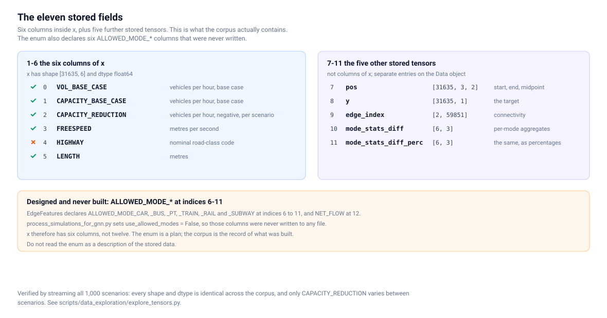
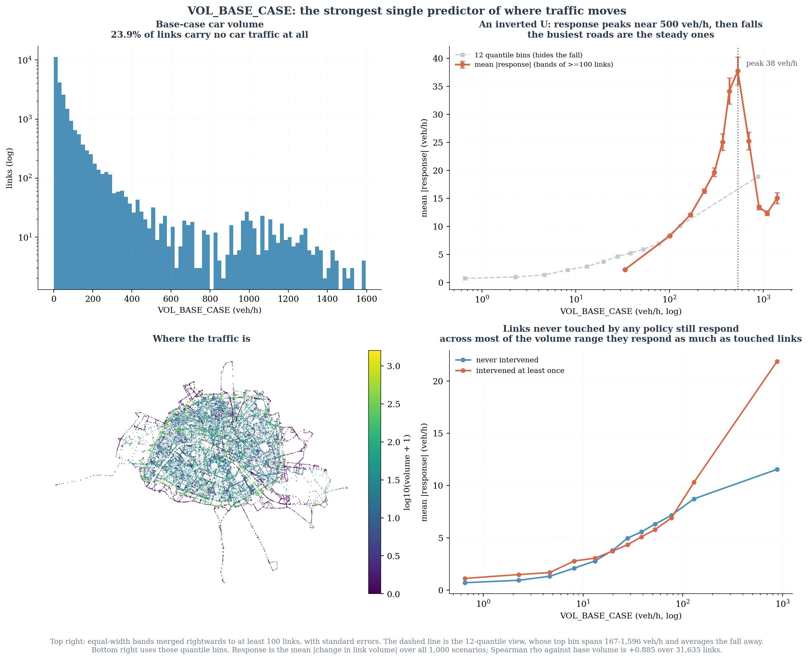

# Data exploration

What is actually inside the published training corpus, verified by reading the
`.pt` files rather than the documentation that describes them.

The corpus is 20 files totalling 2.62 GB on the `train-data-v1` release. Every
number on these pages was recomputed from those files, and every script that
produced one is in `scripts/data_exploration/`.

```bash
CORPUS=/path/to/corpus     # gh release download train-data-v1
CACHE=/path/to/scratch
python scripts/data_exploration/explore_tensors.py  --corpus $CORPUS --cache $CACHE
python scripts/data_exploration/explore_features.py --corpus $CORPUS --cache $CACHE
python scripts/data_exploration/explore_graph.py    --corpus $CORPUS --cache $CACHE
```

## The pages

| Page | What it covers |
|---|---|
| [Stored fields](stored_fields.md) | The `.pt` schema and all eleven stored fields |
| [Model inputs](model_inputs.md) | Which five columns the model consumed, and why HIGHWAY was not one |
| [Graph topology](graph_topology.md) | The line-graph representation, degree, components |
| [Geographic analysis](geographic_analysis.md) | The arrondissement polygons and the real link geometry |
| [Scenario analysis](scenario_analysis.md) | Interventions, responses and representative cases |
| [Auxiliary tensors](auxiliary_tensors.md) | `mode_stats_diff` and the near −100% values |

For the same material drawn for presentation rather than for analysis, see the
[figure gallery](../figures/portfolio/README.md).

## The four things worth knowing

**`x` has six columns, and five of them reach the model.** The enum declares
twelve, but `use_allowed_modes = False` meant six were never written. Anyone
reading `EdgeFeatures` and expecting twelve columns will be wrong about the data.



**Only one column changes between scenarios.** Streaming all 1,000 scenarios and
comparing byte-for-byte against the first: `pos`, `edge_index` and five of the six
`x` columns are identical everywhere. The entire experiment moves through
`CAPACITY_REDUCTION`.

**The model consumes more than five numbers.** Five `x` columns are node
features, and the architecture also reads `pos[:, 0]`, `pos[:, 1]` and
`edge_index`. Saying "only five pieces of information enter the model" is wrong.


**The response goes far beyond the treated roads.** 11,305 of 31,635 links can
ever be intervened, yet trunk roads — never touched by any policy — carry the
second-highest mean response of any road class. That is the whole reason a
network model is needed instead of a lookup table.



## Two corrections this exploration produced

Both are recorded in [`../CORRIGENDUM.md`](../CORRIGENDUM.md).

- **C11** — `num_nodes` is stored as 31,559 while `x`, `pos` and `y` all carry
  31,635 rows. The 76 extra rows are public-transport links with no car access;
  they sit in no edge and their target is exactly zero in every scenario.
  Including them makes the published MAE optimistic by 0.0092 veh/h.
- **C12** — `mode_stats_diff_perc` sits at about −99.99% in all six of its
  rows because the two sides of the subtraction are on different scales. The
  cause is established, not guessed. Neither tensor is read by any model code.
