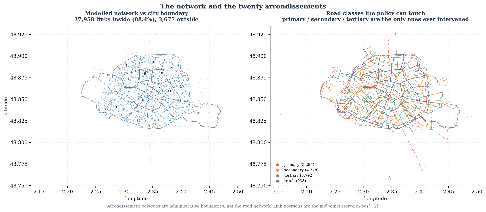

# Geographic analysis

Two independent geographic sources: the coordinates stored inside the corpus, and
a GeoJSON of administrative boundaries. They are different things and are used as
different things.

## `pos`: the real link geometry

`pos` has shape `[31635, 3, 2]`. The three slices are built in
`get_link_geometries`:

```python
start_points = np.array([geom.coords[0]  for geom in links_gdf_input.geometry])
end_points   = np.array([geom.coords[-1] for geom in links_gdf_input.geometry])
edge_midpoints = np.array([((geom.coords[0][0] + geom.coords[-1][0]) / 2,
                            (geom.coords[0][1] + geom.coords[-1][1]) / 2)
                           for geom in links_gdf_input.geometry])
stacked_edge_geometries_tensor = torch.stack(
    [edge_start_point_tensor, edge_end_point_tensor, edge_midpoint_tensor], dim=1)
```

| Slice | Meaning |
|---|---|
| `pos[:, 0, :]` | start coordinate, (lon, lat) |
| `pos[:, 1, :]` | end coordinate, (lon, lat) |
| `pos[:, 2, :]` | midpoint, the mean of the two |

The midpoint claim was checked numerically rather than taken from the code: the
largest deviation between `mean(start, end)` and the stored midpoint is
3.8 × 10⁻⁶ degrees, which is float32 rounding.

**Coordinate system.** WGS84 longitude and latitude, in that order. Bounding box:

| | longitude | latitude |
|---|---|---|
| start / end | 2.15293 … 2.49007 | 48.75772 … 48.92620 |
| midpoint | 2.15302 … 2.49007 | 48.75779 … 48.92620 |

Because these are degrees rather than metres, every map in this repository scales
longitude by `1 / cos(latitude)` so the city is not stretched sideways.

31,504 of the 31,635 links have a unique `(start, end)` pair, so geometry alone
does not identify a link. Row index is the identifier within this corpus; no
MATSim or OSM link id is present in the published tensors.

## The GeoJSON: administrative boundaries only

`data/visualisation/districts_paris.geojson`, 213 KB.

| Property | Value |
|---|---|
| Type | `FeatureCollection`, 20 features |
| Geometry types | `Polygon` only |
| CRS | `urn:ogc:def:crs:OGC:1.3:CRS84` (WGS84 lon/lat) |
| Property keys | `c_ar`, `perimetre`, `surface` |
| `c_ar` values | 1 … 20, complete |
| Bounds | lon 2.22408 … 2.46976, lat 48.81558 … 48.90216 |
| Vertices | 5,008 |

This file contains **no road network**. It is the 20 Paris arrondissement
polygons and nothing else. Any map that needs roads takes them from `pos`; the
GeoJSON only ever supplies boundaries.

The polygon bounds are narrower than the network bounds, which is correct: the
modelled network extends beyond the city limits into the surrounding
Île-de-France.

## Joining the two

Each link is assigned to an arrondissement by point-in-polygon on its midpoint.

| | Links | Share |
|---|---:|---:|
| Inside the city boundary | 27,958 | 88.4% |
| Outside | 3,677 | 11.6% |



## What the districts show

The arrondissements are the policy units: interventions are drawn per district,
so the geographic distribution of treatment is not uniform.

| Quantity | Highest district | Value |
|---|---|---|
| Share of links ever intervened | 16 | 48.1% |
| Mean intervention severity | 8 | 472.3 veh/h |
| Mean absolute response | 14 | 8.03 veh/h |

**Local severity does not determine local response.** Across the 20 districts the
Pearson correlation between mean intervention severity and mean absolute response
is **+0.165** — weak. The most heavily intervened district (8) is not the one
that moves most (14).

Response also concentrates disproportionately relative to size:

| District | Share of total response | Share of links |
|---:|---:|---:|
| 17 | 12.01% | 6.9% |
| 14 | 10.32% | 5.3% |
| 15 | 7.95% | 8.2% |
| 12 | 7.07% | 7.6% |
| 16 | 7.12% | 9.6% |
| 20 | 4.21% | 4.9% |

Districts 17 and 14 each absorb roughly twice the response their share of the
network would suggest.


This is the geographic form of the same result that runs through the whole
project: the effect of a capacity reduction is not local to the reduction.
