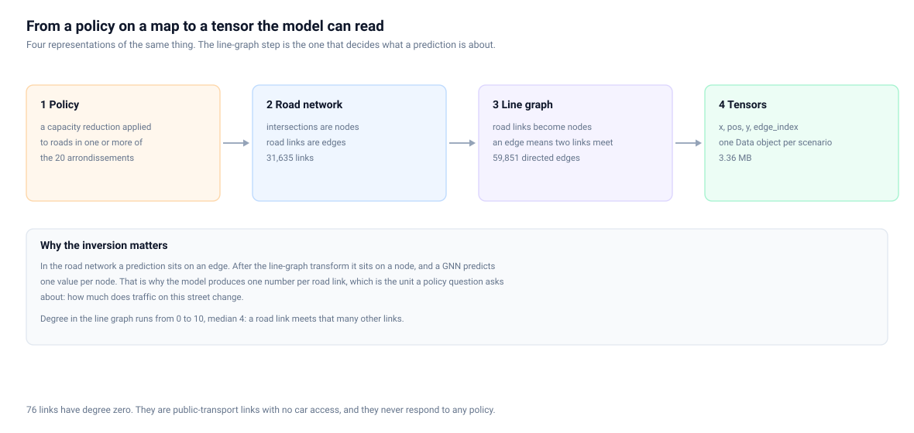
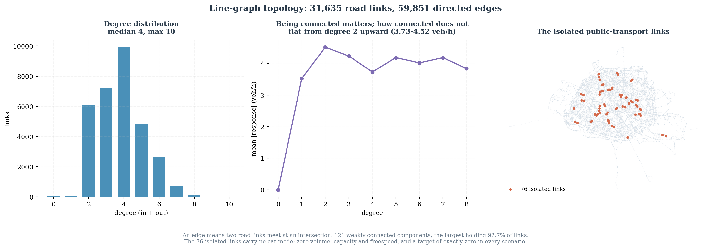

# Graph topology

`edge_index` stores the **line graph** of the Paris road network. That one choice
determines what a prediction is about, so it is worth being precise.

## The transformation

```text
Physical road network              GNN graph

    intersection                       road link  =  node
         |
      road link            ==>         two links that meet
         |                             at an intersection  =  edge
    intersection
```

In the road network a road link is an *edge* between two intersections. After the
line-graph transform each road link becomes a *node*, and an edge means two links
meet. A GNN predicts one value per node, so this inversion is what makes the model
produce one number per road link — which is the unit a policy question asks about:
how much does traffic on this street change.



## The numbers

| Property | Value |
|---|---|
| Nodes (rows in `x`) | 31,635 |
| Directed edges | 59,851 |
| Unique `(src, dst)` pairs | 59,851 (no duplicates) |
| Self-loops | 766 (1.28% of edges) |
| Bidirectional pairs | 5,896 |
| Reciprocity, of non-loop edges | 20.0% |
| Isolated nodes | 76 |
| Degree: min / median / mean / max | 0 / 4 / 3.78 / 10 |
| Max in-degree / out-degree | 6 / 6 |
| Weakly connected components | 121 |
| Strongly connected components | 1,820 |
| Largest weak component | 29,327 nodes (92.70%) |

`edge_index` is byte-identical in all 1,000 scenarios: the topology is fixed and
only the intervention moves.

## Degree distribution

| Degree | Links | Share |
|---:|---:|---:|
| 0 | 76 | 0.24% |
| 1 | 33 | 0.10% |
| 2 | 6,065 | 19.17% |
| 3 | 7,197 | 22.75% |
| 4 | 9,901 | 31.30% |
| 5 | 4,839 | 15.30% |
| 6 | 2,658 | 8.40% |
| 7 | 733 | 2.32% |
| 8 | 128 | 0.40% |
| 9 | 4 | 0.01% |
| 10 | 1 | 0.00% |

Degree 4 is the mode, which is what a grid-like street network produces: a link
with one junction at each end, each junction joining two other links.

Mean |response| by degree is in `graph_topology.json` under `response_by_degree`.
The pattern is a step, not a trend: isolated links respond 0.00, degree-1 links
3.53, and everything from degree 2 to degree 8 sits between 3.73 and 4.52 veh/h
with no ordering. Being connected to the network is what matters; how densely a
link is connected barely moves its response.



## The 121 components

The network is not one connected piece. 92.7% of links sit in a single large
component; the remaining 120 components hold between 1 and 319 links each. The
second largest has 319.

This matters for message passing: a link in a small isolated component can only
ever receive information from its own component, no matter how many layers the
model has.

## Isolated nodes

76 links have degree zero. They are the public-transport links described in
[stored_fields.md](stored_fields.md): no car access, all features zero except
`LENGTH`, `HIGHWAY` = −1, and a target of exactly zero in every scenario. They are
in `x`, `pos` and `y`, and they are counted in the published evaluation totals,
but no message ever reaches them.

## Self-loops and zero-length geometry

Two related but distinct oddities, both checked rather than assumed:

- **766 self-loops**: edges where source and destination are the same link. A link
  is recorded as meeting itself.
- **769 links with coincident endpoints**: `pos[:, 0]` equals `pos[:, 1]`. Their
  stored `LENGTH` is real (median 20 m, max 135 m), so the road has length even
  though its two recorded endpoints are the same point.

Only **348** links are in both sets. They are therefore largely different
phenomena rather than one artefact seen twice, and neither was investigated
further because neither affects the target: `y` is computed from volumes, not
from geometry.
