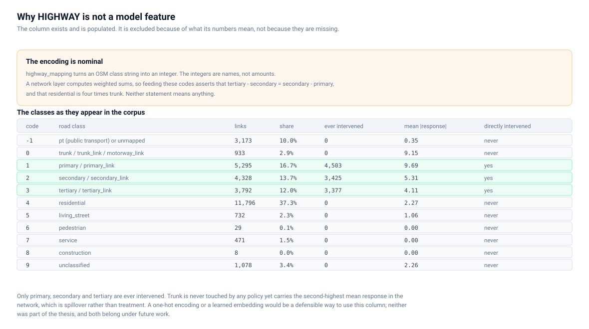
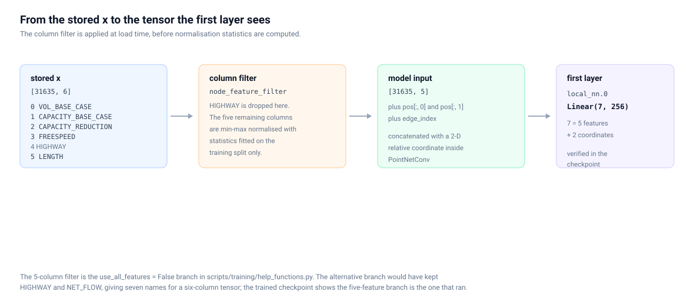

# What the model actually consumes

Traced through the training code, the model definition and the trained Trial 8
checkpoint. The checkpoint is the decisive evidence: it records the shapes the
model was actually built with, which no amount of reading configuration can be
wrong about.

## The five node features

| Feature | In `x` | Used by model | Why / why not |
|---|:--:|:--:|---|
| `VOL_BASE_CASE` | yes | **yes** | Base-case car volume. The strongest single predictor of response, ρ = +0.885. |
| `CAPACITY_BASE_CASE` | yes | **yes** | How much traffic the link can absorb before the reduction. |
| `CAPACITY_REDUCTION` | yes | **yes** | The intervention itself, and the only column that varies between scenarios. |
| `FREESPEED` | yes | **yes** | Free-flow speed; part of what makes a link attractive as a diversion. |
| `HIGHWAY` | yes | **no** | A nominal road class encoded as an integer. See below. |
| `LENGTH` | yes | **yes** | Physical length; weakly related to response alone (ρ = −0.075) but part of the cost of using a link. |


## How this was established

`scripts/training/help_functions.py` chooses between two feature sets:

```python
if use_all_features:
    node_features = [feat.name for feat in EdgeFeatures]
    if not use_allowed_modes:
        node_features = [f for f in node_features if "ALLOWED_MODE" not in f]
else:
    # Most important features (from ablation study)
    node_features = ["VOL_BASE_CASE", "CAPACITY_BASE_CASE", "CAPACITY_REDUCTION",
                     "FREESPEED", "LENGTH"]
```

and applies the choice as a column filter at load time:

```python
node_feature_filter = [EdgeFeatures[feature].value for feature in node_features]
data.x = data.x[:, node_feature_filter]
```

Which branch ran is settled by the checkpoint:

```text
point_net_conv_1.local_nn.0.weight    (256, 7)
```

`PointNetConv` concatenates the node features with a 2-D relative coordinate
before the local network, so 7 − 2 = **5 input channels**. The five-feature
branch is the one that trained Trial 8. The `use_all_features` branch would have
produced seven names — including `NET_FLOW` at index 12 — for a six-column
tensor, which could not have worked.

## Why `HIGHWAY` was excluded

`HIGHWAY` is an integer, but it is not a quantity. `highway_mapping` turns an OSM
class string into a code:

```python
highway = gdf["highway"].apply(lambda x: highway_mapping.get(x, -1)).values
```

The codes are **nominal labels**. There is no sense in which `tertiary − secondary`
equals `secondary − primary`, and no sense in which `residential` (4) is four
times `trunk` (0). A neural network layer computes weighted sums of its inputs,
so passing these codes asserts exactly those relationships. The model would be
free to learn that a road class halfway between "pedestrian" and "service"
exists, which is meaningless.

Excluding the column avoids inventing that arithmetic. It is a deliberate
modelling decision, not a data gap: the column is fully populated.



### The classes, treated categorically

| Code | Road class | Links | Share | Ever intervened | Mean \|response\| | Directly intervened |
|---:|---|---:|---:|---:|---:|---|
| −1 | pt (public transport) or unmapped | 3,173 | 10.0% | 0 | 0.35 | never |
| 0 | trunk / trunk_link / motorway_link | 933 | 2.9% | 0 | **9.15** | never |
| 1 | primary / primary_link | 5,295 | 16.7% | 4,503 | 9.69 | yes |
| 2 | secondary / secondary_link | 4,328 | 13.7% | 3,425 | 5.31 | yes |
| 3 | tertiary / tertiary_link | 3,792 | 12.0% | 3,377 | 4.11 | yes |
| 4 | residential | 11,796 | 37.3% | 0 | 2.27 | never |
| 5 | living_street | 732 | 2.3% | 0 | 1.06 | never |
| 6 | pedestrian | 29 | 0.1% | 0 | 0.00 | never |
| 7 | service | 471 | 1.5% | 0 | 0.00 | never |
| 8 | construction | 8 | 0.0% | 0 | 0.00 | never |
| 9 | unclassified | 1,078 | 3.4% | 0 | 2.26 | never |

Only primary, secondary and tertiary are ever intervened — 11,305 links in total.

The interesting row is **trunk**. No policy in any of the 1,000 scenarios touches
a trunk road, and trunk carries the second-highest mean response in the network.
That response is entirely spillover: traffic diverted off the reduced roads onto
the motorway-grade links. A surrogate that only learned the treated links would
miss it.

### Future work, not thesis methodology

A one-hot encoding of the eleven classes, or a small learned embedding, would be
a defensible way to give the model road-class information without asserting an
order. Neither was part of the thesis, and neither should be described as if it
were.

## The model consumes more than the five columns

`scripts/gnn/models/point_net_transf_gat.py`:

```python
x = data.x.to(self.dtype)
edge_index = data.edge_index

# Use start + end pos (pos shape: [N, 3, 2] for start, end, midpoint)
pos1 = data.pos[:, 0, :]   # Start position
pos2 = data.pos[:, 1, :]   # End position
x = self.point_net_conv_1(x, pos1, edge_index)
x = self.point_net_conv_2(x, pos2, edge_index)
x = self.gat_graph_layers(x, edge_index)
node_predictions = self.gat_final(x, edge_index)
```

| Tensor | Consumed | How |
|---|:--:|---|
| `x`, five columns | yes | node features |
| `pos[:, 0]` | yes | start coordinate, first `PointNetConv` |
| `pos[:, 1]` | yes | end coordinate, second `PointNetConv` |
| `pos[:, 2]` | **no** | midpoint; stored, used only for plotting |
| `edge_index` | yes | connectivity for all six message-passing layers |
| `y` | yes | training target |
| `mode_stats_diff` | **no** | no code path reads it |
| `mode_stats_diff_perc` | **no** | no code path reads it |

The precise statement is therefore:

> Five of the six node-attribute columns in `x` were used as node features. The
> model also consumes graph connectivity and two of the three stored coordinate
> pairs.

It would be wrong to say that only five pieces of information enter the model.



## The mode-stats branch never ran

The model has a `predict_mode_stats` path that reads `data.mode_stats`:

```python
if self.predict_mode_stats:
    mode_stats = data.mode_stats
```

It defaults to `False`, and the Trial 8 checkpoint contains only four modules —
`point_net_conv_1`, `point_net_conv_2`, `gat_graph_layers`, `gat_final` — with no
mode-stats parameters at all. The corpus has no `mode_stats` attribute either,
only `mode_stats_diff` and `mode_stats_diff_perc`, so the branch could not have
run against this data even if it had been enabled.
