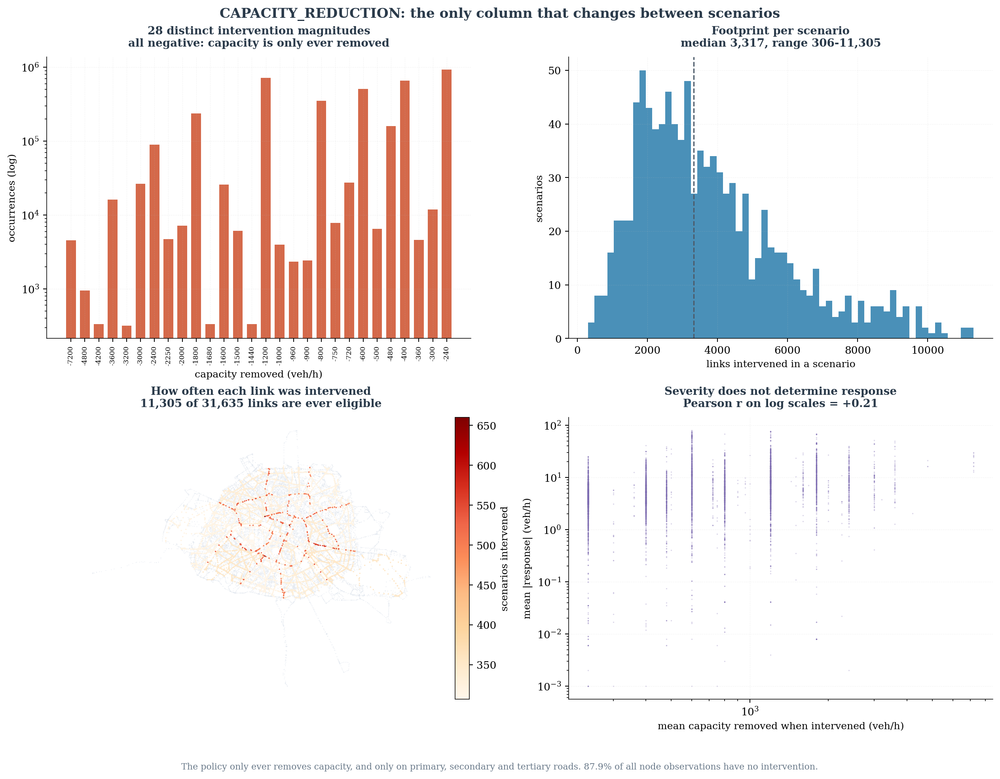
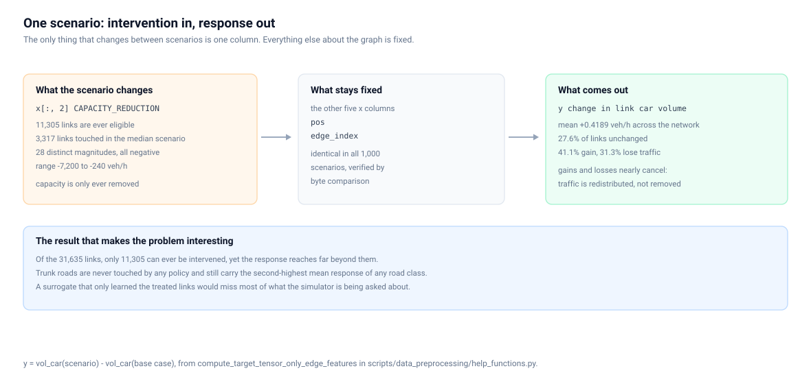

# Scenario analysis

One thing varies between the 1,000 scenarios: `CAPACITY_REDUCTION`. Everything
else about the graph — topology, geometry, the other five feature columns — is
byte-identical throughout. This page is about what that one column does.

## The intervention

| Property | Value |
|---|---|
| Distinct non-zero magnitudes | 28 |
| Sign | always negative — capacity is only ever removed |
| Range | −7,200 … −240 veh/h |
| Median non-zero magnitude | −600 veh/h |
| Zero share, all node observations | 87.94% |
| Links eligible (ever intervened) | 11,305 of 31,635 |
| Links intervened per scenario | min 306, median 3,317, max 11,305, mean 3,814 |
| Most-intervened link | 660 of 1,000 scenarios |
| Mean scenarios per eligible link | 337 |

Only primary, secondary and tertiary roads are ever touched. Trunk, residential,
living street, pedestrian, service, construction, unclassified and public-transport
links are never intervened in any of the 1,000 scenarios.

## The response

`y = vol_car(scenario) − vol_car(base case)`, per link, in veh/h.

| Quantity | Value |
|---|---|
| Mean | +0.4189 veh/h |
| Exactly zero | 27.6% of observations |
| Positive | 41.1% |
| Negative | 31.3% |
| Mean \|response\| per link | 4.09 veh/h |

Gains and losses nearly cancel, because the policy redistributes traffic rather
than removing it.

## Severity does not determine response

Within the eligible links, the correlation between how much capacity a link loses
and how much its volume moves is weak: Pearson r = **+0.21** on log scales, over
the 11,305 links that are ever intervened. At district level the same comparison
gives **+0.165**.

The reason is that a link's response depends on the whole network around it, not
on its own treatment. Two facts make this concrete:

- **Trunk roads are never intervened** and carry the second-highest mean response
  of any road class, 9.15 veh/h.
- Across most of the volume range, links that were **never** intervened respond
  about as strongly as links that were.

That is why the surrogate has to be a network model. A per-link lookup of
"capacity removed → volume change" would capture almost none of this.

## Representative scenarios

Selected by rule, never by eye. Every rule is an extremum or a quantile of a
measured quantity, so the selection is reproducible.
(`representative_scenarios.json`)

| Rule | Scenario | Links intervened | Off-site response share |
|---|---:|---:|---:|
| smallest footprint | 199 | 306 | 91.8% |
| q25 footprint | 565 | 2,224 | 75.5% |
| median footprint | 279 | 3,318 | 64.5% |
| q75 footprint | 130 | 4,889 | 54.4% |
| largest footprint | 95 | 11,305 | 33.6% |
| highest off-site share | 199 | 306 | 91.8% |
| lowest off-site share | 94 | 11,101 | 33.5% |
| largest total response | 94 | 11,101 | 33.5% |
| smallest total response | 990 | 1,200 | 87.2% |
| most response per unit capacity | 199 | 306 | 91.8% |
| least response per unit capacity | 409 | 8,144 | 46.3% |
| most capacity removed | 95 | 11,305 | 33.6% |

"Off-site response share" is the fraction of total absolute response that lands on
links the scenario did **not** intervene on.

The pattern across the table is the interesting part: the smaller the
intervention, the larger the share of its effect that appears somewhere else. The
306-link scenario puts 91.8% of its response off-site; the 11,305-link scenario
only 33.6%, simply because it has touched most of the eligible network itself.

## Representative links

(`representative_links.json`)

| Rule | Row | Road class | Times intervened | Mean \|response\| |
|---|---:|---:|---:|---:|
| most often intervened | 20093 | primary | 660 | 28.86 |
| most volatile response | 9884 | primary | 334 | 75.63 |
| busiest base volume | 18785 | trunk | 0 | 54.43 |
| most reactive never intervened | 18785 | trunk | 0 | 54.43 |
| longest link | 30244 | pt / unmapped | 0 | 0.00 |
| highest capacity | 8483 | primary | 515 | 25.57 |
| highest degree | 6608 | secondary | 326 | 5.02 |
| isolated | 31559 | pt / unmapped | 0 | 0.00 |

Row 18785 is the clearest single example in the corpus: it is the busiest link in
the network, it is a trunk road so **no policy ever touches it**, and it still has
the largest mean response of any never-intervened link. It is the narrative link
used elsewhere in the documentation.

Row 31559 is the first of the 76 isolated public-transport links — no edges, no
car access, and a target of exactly zero in every scenario.

## Full-corpus basis

Every number here is computed over all 20 batch files: 1,000 scenarios ×
31,635 links = **31,635,000 node observations**. The corpus is streamed once and
reduced to cached arrays (`red`, `y`, `static`, `pos`, `edge_index`) rather than
held in memory as 31.6 million rows.
