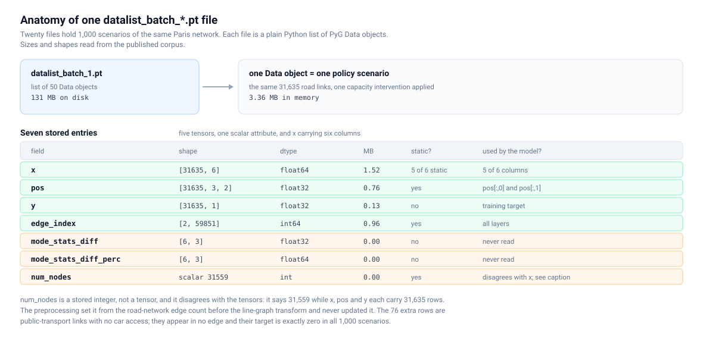
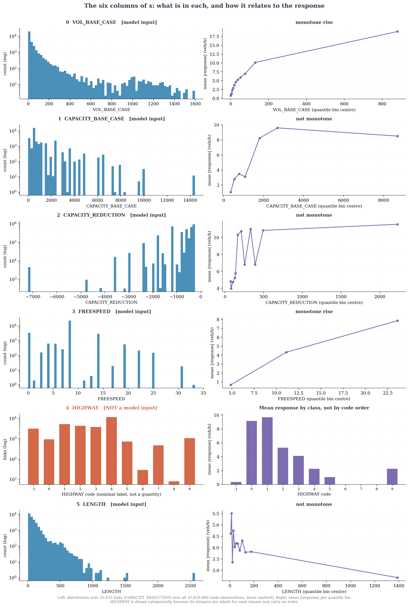
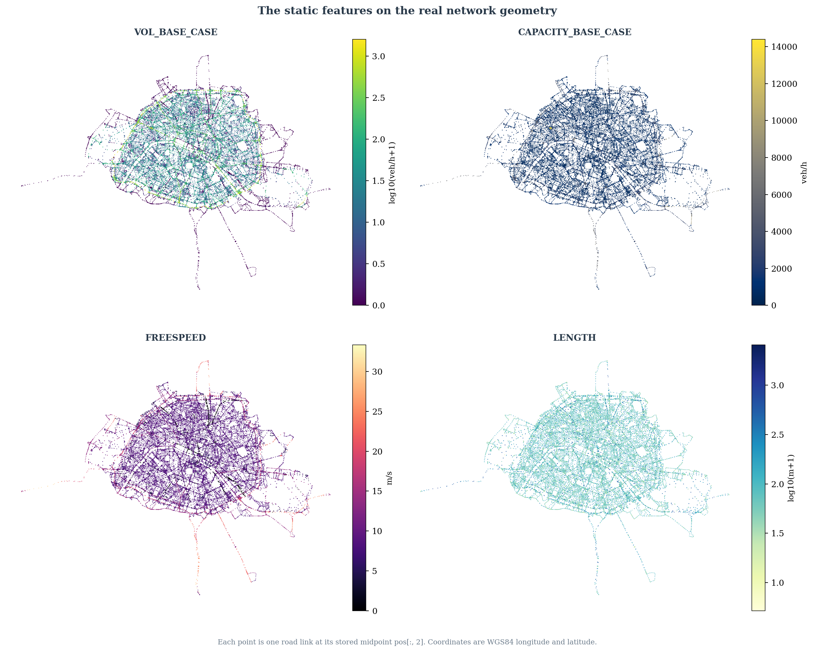
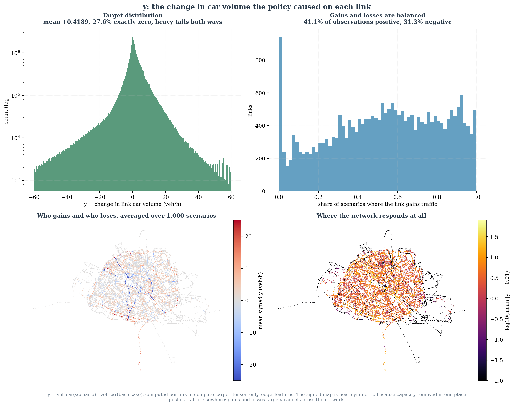

# The stored fields

Everything here comes from loading the real `.pt` objects. Where a claim is about
the whole corpus, it was checked by streaming all 1,000 scenarios, not inferred
from one.

## The schema, as it actually is

```text
Data(edge_index=[2, 59851], num_nodes=31559, x=[31635, 6], pos=[31635, 3, 2],
     y=[31635, 1], mode_stats_diff=[6, 3], mode_stats_diff_perc=[6, 3])
```

Each of the 20 files is a plain Python `list` of 50 `torch_geometric.data.Data`
objects: 1,000 scenarios in total, each 3.36 MB in memory.

| Field | Shape | dtype | MB | Static across scenarios | Read by the model |
|---|---|---|---|---|---|
| `x` | `[31635, 6]` | float64 | 1.52 | 5 of 6 columns | 5 of 6 columns |
| `pos` | `[31635, 3, 2]` | float32 | 0.76 | yes | `pos[:,0]`, `pos[:,1]` |
| `y` | `[31635, 1]` | float32 | 0.13 | no | training target |
| `edge_index` | `[2, 59851]` | int64 | 0.96 | yes | every layer |
| `mode_stats_diff` | `[6, 3]` | float32 | ~0 | no | never |
| `mode_stats_diff_perc` | `[6, 3]` | float64 | ~0 | no | never |
| `num_nodes` | scalar `31559` | int | ~0 | yes | see below |



## Invariants, checked over all 1,000 scenarios

| Claim | Result |
|---|---|
| Shapes identical in every scenario | true |
| dtypes identical in every scenario | true |
| The five static `x` columns byte-identical | true |
| `pos` byte-identical | true |
| `edge_index` byte-identical | true |
| `CAPACITY_REDUCTION` varies | true |
| Distinct `num_nodes` values seen | `[31559]` only |
| NaNs anywhere in the two auxiliary tensors | none |

The experiment is therefore driven entirely by one column. Everything else about
the graph is fixed.

## `num_nodes` disagrees with the tensors

`num_nodes` is 31,559. `x`, `pos` and `y` each have 31,635 rows. The gap is 76.

The cause is in the preprocessing:

```python
data = Data(edge_index=edge_index)
data.num_nodes = edge_index.shape[1] if use_linegraph else len(nodes)
if use_linegraph:
    data = linegraph_transformation(data)
data.x = edge_tensor
```

`num_nodes` is set from the **road-network** edge count before the line-graph
transform, then never updated after `x` is assigned. `max(edge_index) + 1` is
also 31,559, so the graph really does only address that many nodes.

The 76 trailing rows are not padding. They carry a real `LENGTH` (20 m to 1,528 m)
and real coordinates inside Paris, but:

- `VOL_BASE_CASE`, `CAPACITY_BASE_CASE`, `FREESPEED` and `CAPACITY_REDUCTION` are
  all exactly zero;
- `HIGHWAY` is −1 for every one of them, the code for public transport;
- they appear in no edge, so their degree is zero;
- `y` is exactly zero in all 1,000 scenarios.

That follows from the preprocessing, which zeroes capacity and freespeed on links
without a car mode:

```python
capacities_new = np.where(gdf["modes"].str.contains("car"), gdf["capacity"], 0)
freespeed      = np.where(gdf["modes"].str.contains("car"), gdf["freespeed"], 0)
```

With no car volume in either the base case or the scenario, `y = 0 − 0 = 0`.

**Effect on the published metrics.** The evaluation counts 3,163,500 nodes, which
is 100 graphs × 31,635, so those 7,600 trivially-zero nodes are included. Recomputed
from `test_predictions.npz`:

| Subset | MAE | RMSE | R² | n |
|---|---|---|---|---|
| All rows, as published | 3.9573 | 7.1183 | 0.5957 | 3,163,500 |
| Excluding the 76 isolated links | 3.9665 | 7.1268 | 0.5957 | 3,155,900 |
| The isolated links alone | 0.1198 | 0.1292 | — | 7,600 |

Including them makes MAE optimistic by 0.0092 veh/h, a 0.23% relative difference.
R² is unchanged at four decimals. Recorded as CORRIGENDUM C11.

## The eleven fields

Six columns inside `x`:

| # | Column | Unit | Static | Model input |
|---|---|---|---|---|
| 1 | `VOL_BASE_CASE` | veh/h | yes | yes |
| 2 | `CAPACITY_BASE_CASE` | veh/h | yes | yes |
| 3 | `CAPACITY_REDUCTION` | veh/h, ≤ 0 | **no** | yes |
| 4 | `FREESPEED` | m/s | yes | yes |
| 5 | `HIGHWAY` | nominal code | yes | **no** |
| 6 | `LENGTH` | m | yes | yes |

Five further stored tensors:

| # | Field | What it is |
|---|---|---|
| 7 | `pos` | start, end and midpoint coordinates, WGS84 |
| 8 | `y` | the target: change in link car volume |
| 9 | `edge_index` | line-graph connectivity |
| 10 | `mode_stats_diff` | per-mode aggregate differences |
| 11 | `mode_stats_diff_perc` | the same, as percentages |

## The six columns that were designed and never built

`EdgeFeatures` declares thirteen members:

```python
VOL_BASE_CASE = 0        FREESPEED = 3      ALLOWED_MODE_CAR = 6    ALLOWED_MODE_RAIL = 10
CAPACITY_BASE_CASE = 1   HIGHWAY = 4        ALLOWED_MODE_BUS = 7    ALLOWED_MODE_SUBWAY = 11
CAPACITY_REDUCTION = 2   LENGTH = 5         ALLOWED_MODE_PT = 8     NET_FLOW = 12
                                            ALLOWED_MODE_TRAIN = 9
```

`process_simulations_for_gnn.py` sets `use_allowed_modes = False`, and the six
`ALLOWED_MODE_*` columns at indices 6–11 were never written. The stored `x` has
six columns, not twelve. The enum records a plan; the corpus records what was
built, and only the corpus should be read as a description of the data.

## Feature statistics, full corpus

Static columns are summarised over 31,635 links. `CAPACITY_REDUCTION` is
summarised over all 31,635,000 node observations.

| Feature | min | q1 | median | q3 | max | mean | std | distinct | zero % |
|---|---|---|---|---|---|---|---|---|---|
| `VOL_BASE_CASE` | 0 | 0.238 | 10.93 | 45.27 | 1,596 | 50.91 | 135.83 | 5,694 | 23.86 |
| `CAPACITY_BASE_CASE` | 0 | 480 | 480 | 1,200 | 14,400 | 1,028.96 | 1,264.45 | 36 | 10.79 |
| `FREESPEED` | 0 | 8.333 | 8.333 | 8.333 | 33.33 | 8.15 | 4.01 | 16 | 10.79 |
| `LENGTH` | 4.17 | 25.00 | 58.36 | 114.48 | 2,568.58 | 91.60 | 109.94 | 23,257 | 0.00 |
| `CAPACITY_REDUCTION`, all | −7,200 | 0 | 0 | 0 | 0 | −93.33 | 334.03 | 29 | 87.94 |
| `CAPACITY_REDUCTION`, non-zero only | −7,200 | −1,200 | −600 | −400 | −240 | −774.21 | 631.17 | 28 | — |

No NaNs anywhere. `HIGHWAY` is deliberately absent from this table: see
[model_inputs.md](model_inputs.md).

Rank correlation with mean |response| per link:

| Feature | Spearman ρ |
|---|---|
| `VOL_BASE_CASE` | **+0.885** |
| `CAPACITY_BASE_CASE` | +0.476 |
| `FREESPEED` | +0.411 |
| `LENGTH` | −0.075 |



### `VOL_BASE_CASE`

The strongest single predictor of where traffic moves, at ρ = +0.885. The shape
of the relationship is an **inverted U**, and getting to that took two passes.

Twelve volume *quantile* bins show a monotone rise, from 0.74 veh/h in the
quietest to 18.91 veh/h in the busiest. That view is misleading: the top quantile
bin spans 167 to 1,596 veh/h and averages away everything inside it. Almost all
links are quiet, so quantile bins cannot resolve the sparse, busy tail.

Re-binned at 67 veh/h and merged rightwards until each band holds at least 100
links, the tail is clear:

| Volume band (veh/h) | Links | Mean \|response\| | s.e.m. |
|---|---:|---:|---:|
| 0 – 67 | 26,132 | 2.32 | 0.02 |
| 67 – 134 | 2,871 | 8.31 | 0.08 |
| 134 – 201 | 1,057 | 12.07 | 0.21 |
| 201 – 268 | 490 | 16.30 | 0.40 |
| 268 – 335 | 277 | 19.68 | 0.76 |
| 335 – 402 | 157 | 25.05 | 1.51 |
| 402 – 469 | 102 | 34.16 | 2.35 |
| **469 – 603** | 112 | **37.75** ← peak | 2.46 |
| 603 – 804 | 108 | 25.25 | 1.59 |
| 804 – 1005 | 100 | 13.41 | 0.41 |
| 1005 – 1206 | 133 | 12.38 | 0.45 |
| 1206 – 1608 | 96 | 15.04 | 0.98 |

Response climbs to about 38 veh/h near 500 veh/h of base volume and then falls to
roughly 13. The fall is many standard errors wide, so it is not sampling noise:
grouped more coarsely, 400–600 gives 36.12 ± 1.70 (n = 216), 600–900 gives
23.13 ± 1.38 (n = 131), and 900–1,600 gives 13.49 ± 0.39 (n = 306).

**So the busiest roads are the steady ones.** They are motorway-class links with
high capacity, and a diversion that would overwhelm an ordinary street is absorbed
by them without much change in volume. It is the *merely* busy roads, around 500
veh/h, that swing hardest. This confirms the inverted-U reading already recorded in
[`02_features.md`](../portfolio_data_story/02_features.md).

Relative response, |response| divided by volume, falls monotonically across the
quantile bins from 3.24 to 0.059 — the busiest links change least as a fraction of
what they already carry.

### `CAPACITY_BASE_CASE`

Only 36 distinct values, and half the network sits at exactly 480 veh/h. The
response curve is **not** monotone: it peaks in the 2,400–3,000 veh/h bin at 9.60
veh/h and falls to 8.51 in the highest-capacity bin. Very high capacity roads are
also the ones best able to absorb a diversion without changing much.

### `CAPACITY_REDUCTION`

The experimental knob, covered in [scenario_analysis.md](scenario_analysis.md).
28 distinct non-zero magnitudes, every one negative: capacity is only ever
removed.

### `FREESPEED`

Sixteen distinct values, strongly clustered — 8.333 m/s (30 km/h) is the median,
the q1 and the q3. Response rises with free-flow speed.

### `LENGTH`

The only column with essentially no rank relationship to the response
(ρ = −0.075), and its binned curve is flat and non-monotone. Length matters to the
simulator, but on its own it does not predict which links move.



## `y`, the target

```python
def compute_target_tensor_only_edge_features(vol_base_case, gdf):
    edge_car_volume_difference = gdf["vol_car"].values - vol_base_case
    return torch.tensor(edge_car_volume_difference, dtype=torch.float).unsqueeze(1)
```

`y` is the change in car volume on the link, in veh/h: scenario minus base case.
Positive means the link gained traffic.

| Quantity | Value |
|---|---|
| mean | +0.4189 veh/h |
| exactly zero | 27.6% of observations |
| positive | 41.1% |
| negative | 31.3% |

Gains and losses nearly cancel, which is what redistribution looks like: removing
capacity in one place pushes traffic elsewhere rather than removing it from the
network.


