# One diagram per stored field

Eleven cards, one for every field the corpus stores: the six columns inside `x`,
and the five further tensors alongside it.

Each card answers the same questions in the same places, so they can be read as a
set: what the field is, where it is, how it is distributed, and what it does. The
numbers in the strip along the foot are read from
[`feature_statistics.json`](../../portfolio_data_story/assets/feature_statistics.json)
and the tensor assets, not recomputed, so a card cannot disagree with the
published data.

```bash
python scripts/data_exploration/explore_tensors.py  --corpus $CORPUS --cache $CACHE
python scripts/figure_generation/generate_feature_cards.py --corpus $CORPUS --cache $CACHE
```

| # | Field | Where it lives | Model input |
|---|---|---|---|
| 1 | `VOL_BASE_CASE` | `x[:, 0]` | yes |
| 2 | `CAPACITY_BASE_CASE` | `x[:, 1]` | yes |
| 3 | `CAPACITY_REDUCTION` | `x[:, 2]` | yes |
| 4 | `FREESPEED` | `x[:, 3]` | yes |
| 5 | `HIGHWAY` | `x[:, 4]` | **no** |
| 6 | `LENGTH` | `x[:, 5]` | yes |
| 7 | `pos` | its own tensor | two of three slices |
| 8 | `y` | its own tensor | the training target |
| 9 | `edge_index` | its own tensor | all six layers |
| 10 | `mode_stats_diff` | its own tensor | **never read** |
| 11 | `mode_stats_diff_perc` | its own tensor | **never read** |

---

## The six columns of `x`

### 0 · VOL_BASE_CASE
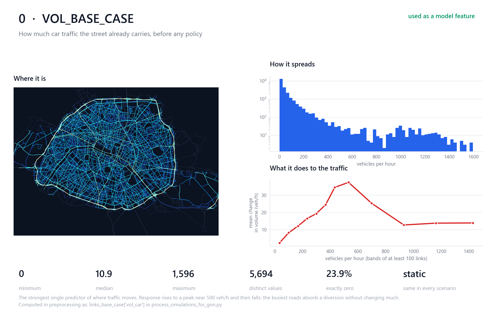

### 1 · CAPACITY_BASE_CASE
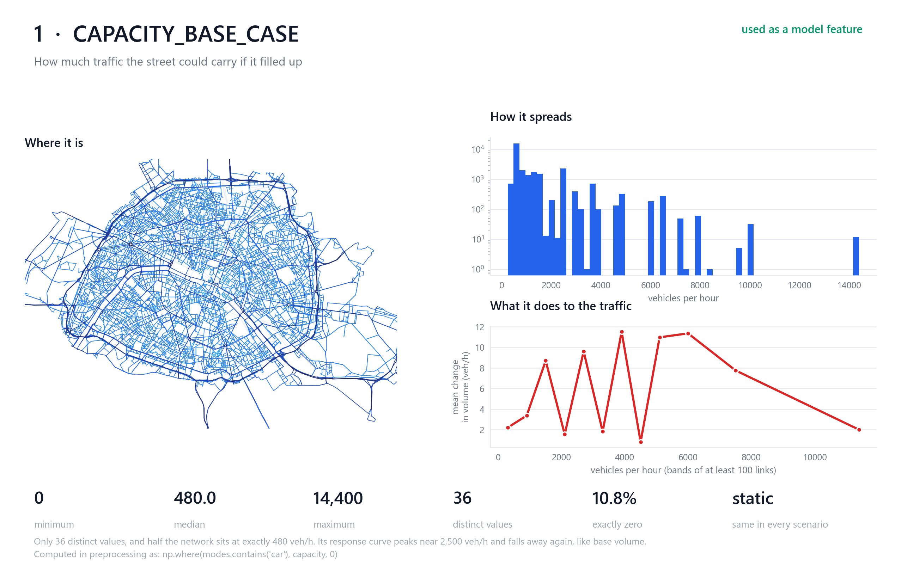

### 2 · CAPACITY_REDUCTION
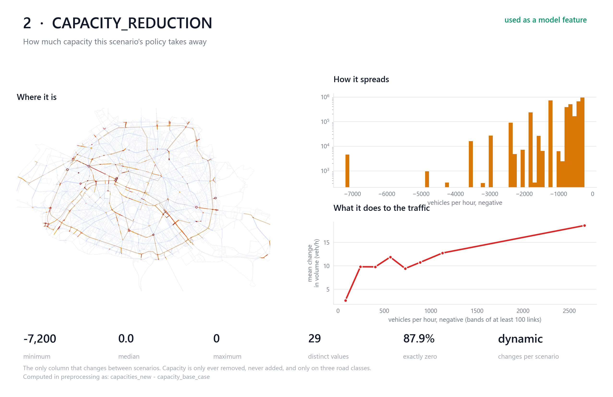

The only column that differs between scenarios. Everything else about the network is
byte-identical across all 1,000.

### 3 · FREESPEED
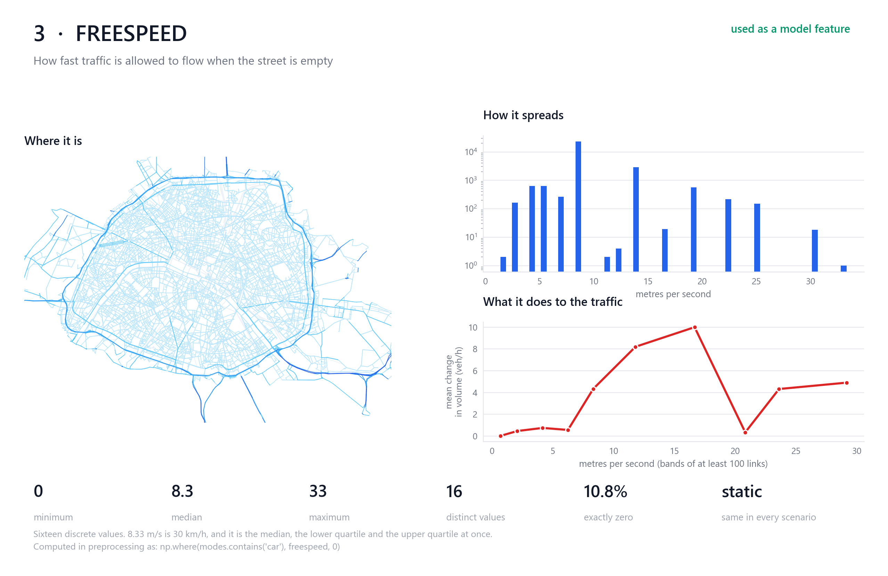

### 4 · HIGHWAY
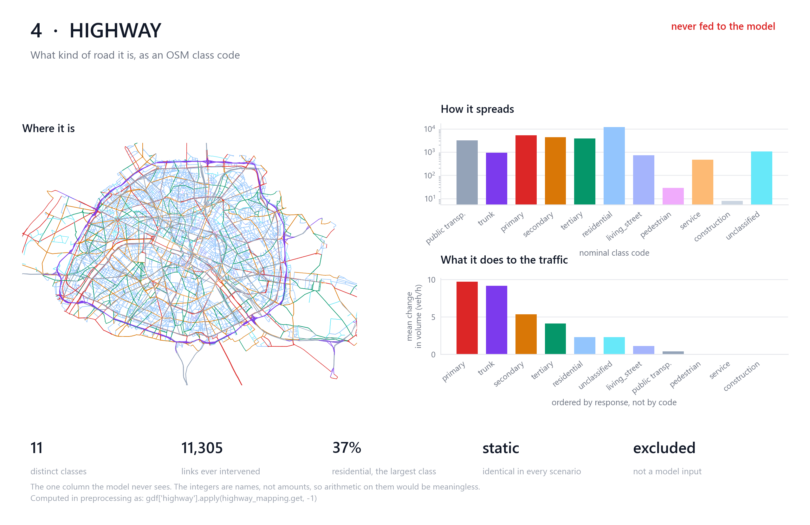

Categorical throughout, and the only column the model never sees. Its integers are
names for road classes, so a mean or a correlation would be meaningless.

### 5 · LENGTH
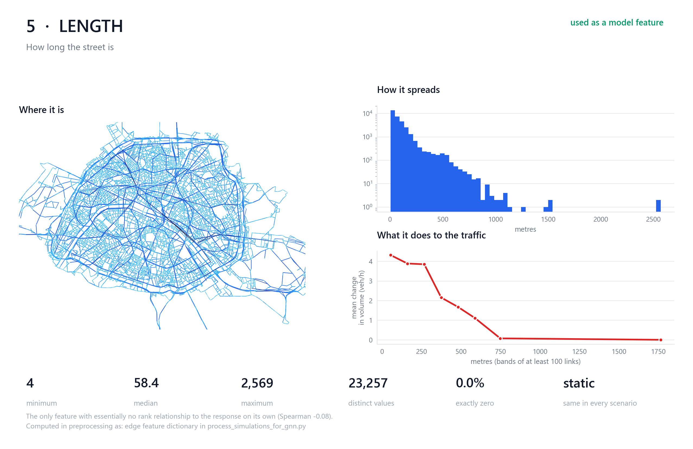

---

## The five other stored tensors

### 6 · pos
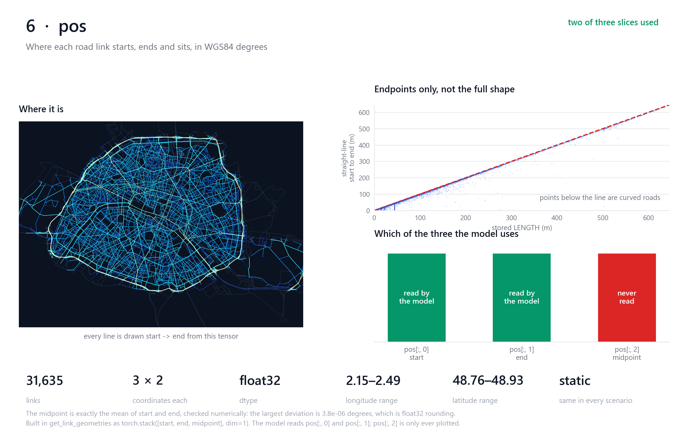

Start, end and midpoint per link. The model reads the first two; the midpoint is
stored and only ever plotted.

### 7 · y
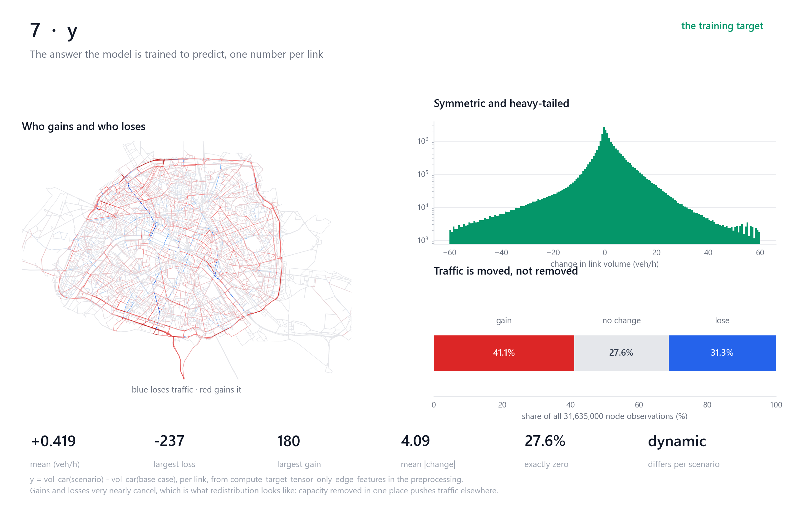

The target. Gains and losses nearly cancel — the policy moves traffic rather than
removing it.

### 8 · edge_index
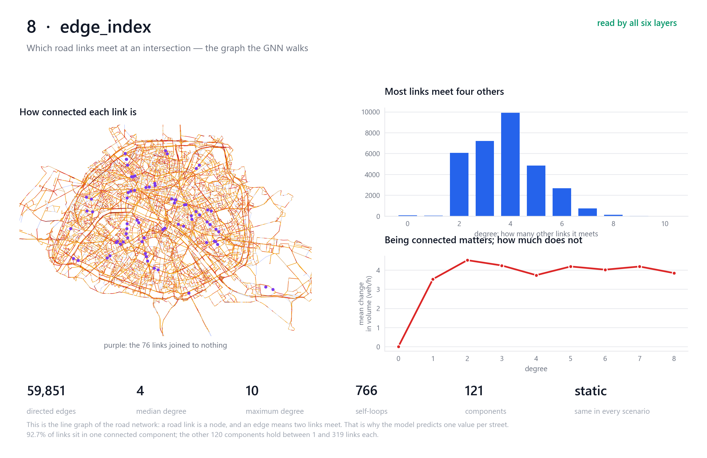

The line graph: a road link is a node, an edge means two links meet. That inversion is
why the model predicts one value per street.

### 9 · mode_stats_diff
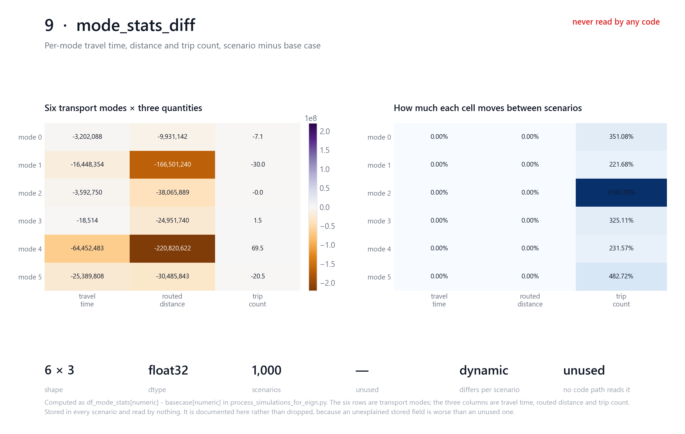

### 10 · mode_stats_diff_perc
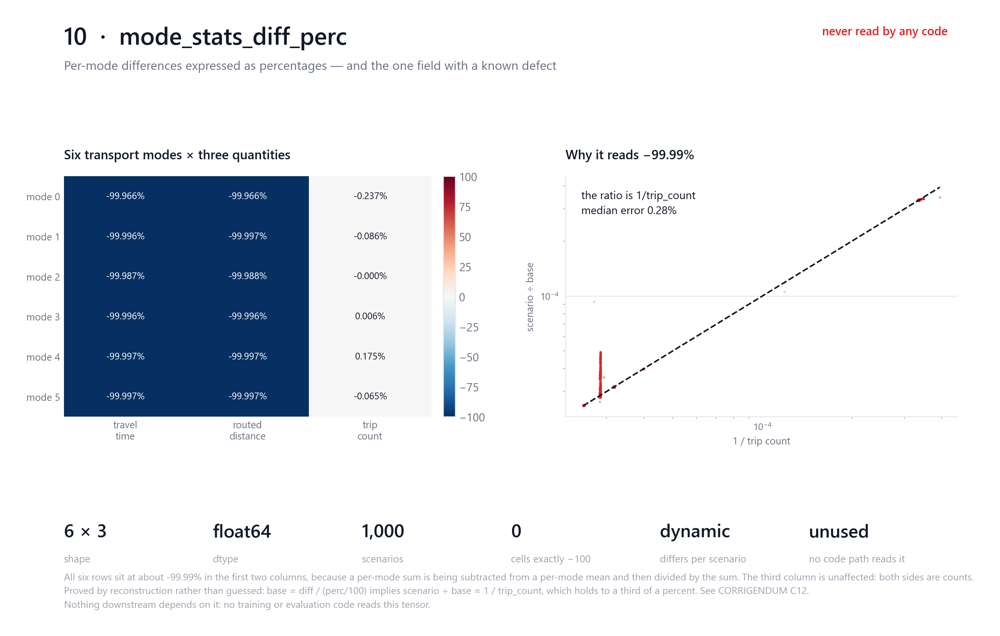

Both are stored in every scenario and read by nothing. The percentages sit at about
−99.99% because a per-mode sum is subtracted from a per-mode mean; the right-hand
panel is the reconstruction that proves it rather than asserting it. See
[CORRIGENDUM C12](../../CORRIGENDUM.md).

---

The response panel on every continuous card uses equal-width bands merged rightwards
until each holds at least 100 links. Quantile bins were tried first and hid the turn in
`VOL_BASE_CASE` entirely inside their top bin.
