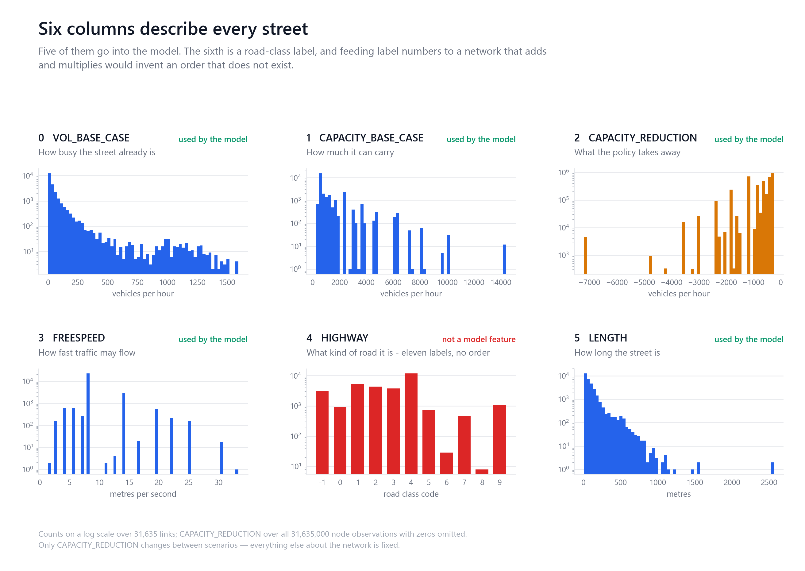
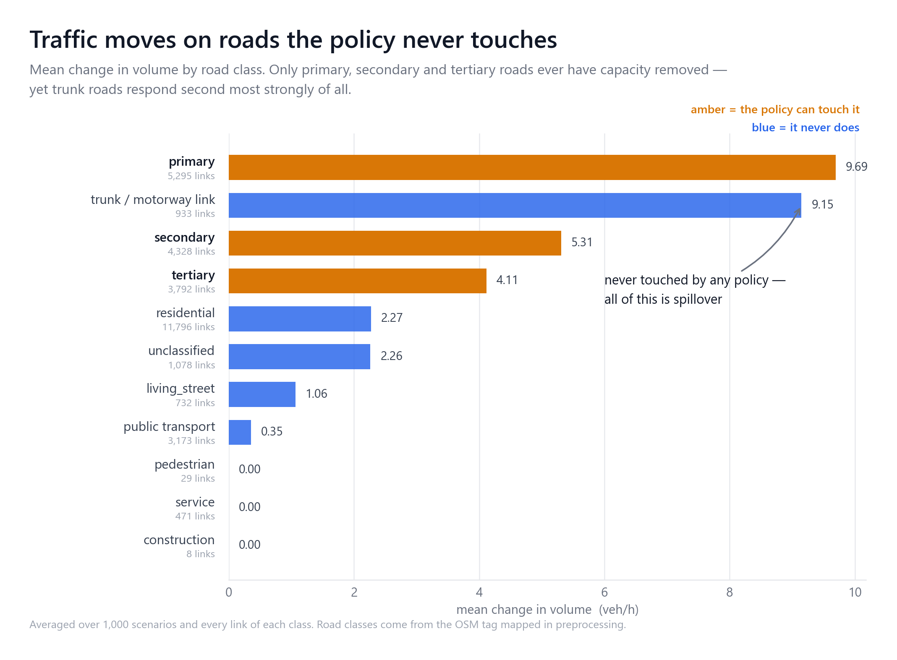
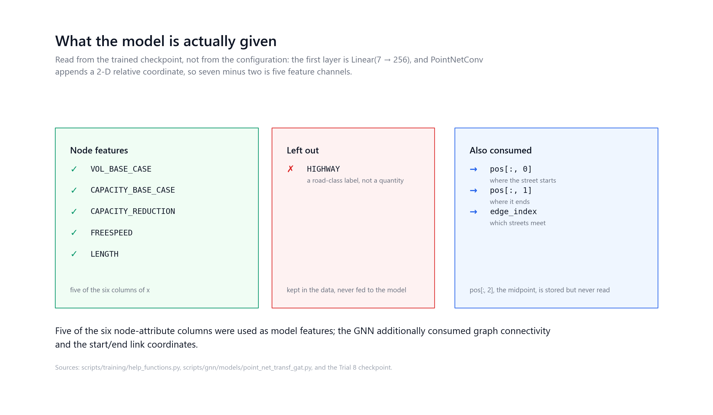

# Figure gallery

Seven figures built to be looked at rather than squinted at. Each carries one idea,
states its takeaway on the chart, and labels its series in place so nothing depends
on a legend.

Every number comes from the published corpus — 1,000 scenarios × 31,635 links — and
every figure is regenerated by one command:

```bash
python scripts/figure_generation/generate_portfolio_figures.py \
    --corpus $CORPUS --cache $CACHE
```

The maps draw the real street geometry. Each link is a segment from its own stored
`pos[:, 0]` to `pos[:, 1]`, so the shape is the actual road network of Paris rather
than a cloud of midpoints.

---

### 1 · The network


All 31,635 links, shaded by the car volume they carry before any policy is applied.
The Périphérique and the radial boulevards emerge from the data alone.

### 2 · The six columns



What each column of `x` holds, and which five the model consumes.

### 3 · The inverted U


The most interesting shape in the dataset: response rises with base volume to a peak
near 500 veh/h, then falls. The busiest roads absorb a diversion without changing much.

### 4 · Policy against response


Capacity is only ever removed from three road classes. The response covers the whole
network. This is the figure that argues for a graph model.

### 5 · Road classes



Trunk roads are never intervened and respond second most strongly of any class.

### 6 · Model inputs



Five of six `x` columns, plus connectivity and the start/end coordinates. Read from the
trained checkpoint rather than from configuration.

### 7 · Arrondissements


Interventions are drawn per district; where the traffic moves is almost unrelated to
where capacity was removed (r = +0.17 across the twenty districts).

### 8 · The model


Every shape and parameter count is read out of the Trial 8 checkpoint, so the diagram
cannot drift away from the model it describes.

```bash
python scripts/figure_generation/generate_model_diagram.py
```

---

## Design notes

- **Colour carries meaning, not decoration.** Amber marks what the policy can touch,
  blue what it never does, red the response.
- **Two map palettes.** `FLOW` and `HEAT` begin near black for dark-ground maps;
  `HEAT_LIGHT` begins near the paper, because a dark-ground ramp on white reads as
  scribble.
- **Framing.** Maps are framed on a percentile of the endpoints. A handful of links run
  far south of Paris, and framing on the raw extent shrinks the city to a smudge.
- **Bins that can resolve what they claim.** The volume figure uses equal-width bands
  merged until each holds at least 100 links, with standard errors. Quantile bins were
  tried first and hid the fall entirely inside their top bin.

The analysis-grade versions of the same material, with more panels and less styling,
are in [`../data_exploration/`](../data_exploration/).
